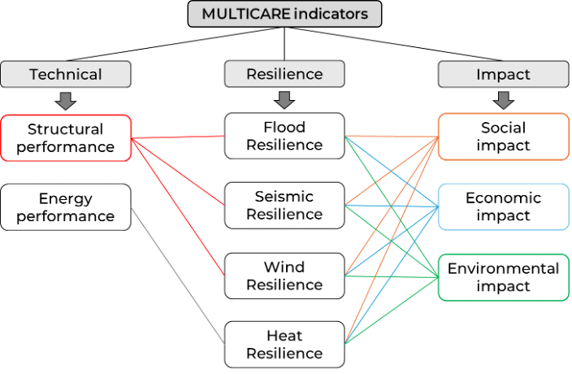
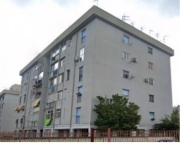
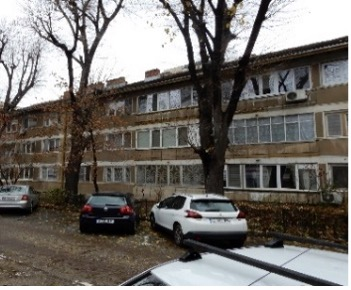
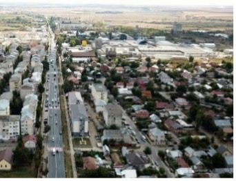

# D4.1 Technology requirements and KPIs

**Dissemination Level: Public**

**Lead Partner: TU Delft**

**Due date: 31 March 2024**

**Actual submission date: 31 March 2024**

## PUBLISHED IN THE FRAMEWORK OF

MULTICARE (Horizon Europe grant 101123467)

## AUTHORS

Alessandra Luna Navarro, TU Delft

Anna Maria Koniari, TU Delft

Cristina Vaccarella, RINA-C

Francesco Petrini, UNIROMA1

Kyra Koning, AMS Institute

Kyujin Kim, TU Delft

Matteo Porta, RINA-C

Michele Matteoni, UNIROMA1

Nicu Ciobotaru, UTUV

Romulus Costache, UTUV

Simona Bianchi, TU Delft

Zhikai Peng, AMS Institute

## REVISION AND HISTORY CHART

| **VERSION** | **DATE** | **EDITORS** | **COMMENT** |
| --- | --- | --- | --- |
| V0.1 | 1 March 2024 | Simona Bianchi (TU Delft)  Cristina Vaccarella (RINA-C) | Draft |
| V0.2 | 10 March 2024 | Nicu Ciobotaru (UTUV)  Romulus Costache (UTUV) | Draft |
| V0.3 | 12 March 2024 | Anna Maria Koniari (TU Delft)  Kyra Koning (AMS Institute) | Draft |
| V0.4 | 13 March 2024 | Kyujin Kim (TU Delft)  Zhikai Peng (AMS Institute)  Alessandra Luna Navarro (TU Delft) | Draft |
| V0.5 | 18 March 2024 | Michele Matteoni (UNIROMA1)  Francesco Petrini (UNIROMA1) | Draft |
| V0.6 | 22 March 2024 | Matteo Porta (RINA-C)  Cristina Vaccarella (RINA-C) | Review |
| V1.0 | 26 March 2024 | Simona Bianchi (TU Delft) | Final Version |

## DISCLAIMER

The information in this document is subject to change without notice. Company or product names mentioned in this document may be trademarks or registered trademarks of their respective companies.

**All rights reserved**

The document is proprietary of the MULTICARE consortium members. No copying or distributing, in any form or by any means, is allowed without the prior written agreement of the owner of the property rights. This document reflects only the authors’ view. The European Community is not liable for any use that may be made of the information contained herein. Responsibility for the information and views expressed  
in the therein lies entirely with the author(s).

# Executive Summary

This report outlines the Key Performance Indicators (KPIs) and related calculation methodologies for evaluating the effectiveness of the MULTICARE technical solutions. These KPIs are chosen from a diverse array of sources, encompassing regulatory requirements, European and national standards, as well as cutting-edge indicators derived from literature. Tailored to encompass a multi-risk perspective, the selected KPIs will facilitate an analysis of the benefits derived from the proposed interventions (façade and exoskeleton solutions, flood mitigation strategies) on the MULTICARE physical (Acerra, Bucharest, Amsterdam) and virtual (Tecuci) demonstrators. Encompassing various domains, such as technical, economic, environmental and social factors, these KPIs collectively form a comprehensive assessment framework. Methods for data collection will consist of simulations, monitoring, interviews and co-design workshops engaging essential building user groups. Further refinement of the KPIs is planned for D4.4 (M9), pending additional insights into sensor availability, simulation data and other factors.

This deliverable, authored by TU Delft, AMS Institute, UNIROMA1, RINA-C and UTBV, delineates the methodology's scope. Rigorous review by relevant partners responsible for specific interventions ensures its appropriateness and robustness.

# Table of contents

[D4.1 Technology requirements and KPIs 2](#_Toc162386513)

[PUBLISHED IN THE FRAMEWORK OF 2](#_Toc162386514)

[AUTHORS 2](#_Toc162386515)

[REVISION AND HISTORY CHART 2](#_Toc162386516)

[DISCLAIMER 3](#_Toc162386517)

[Executive Summary 4](#_Toc162386518)

[Table of contents 5](#_Toc162386519)

[LIST OF FIGURES 6](#_Toc162386520)

[LIST OF TABLES 6](#_Toc162386521)

[GLOSSARY 7](#_Toc162386522)

[1\. Introduction 8](#_Toc162386523)

[1.1. MULTICARE project 8](#_Toc162386524)

[1.2. Technology Requirements and KPIs 10](#_Toc162386525)

[1.1.1. Objectives and method 11](#_Toc162386526)

[1.1.2. Relation to other activities 11](#_Toc162386527)

[2\. KPIs definition 13](#_Toc162386528)

[2.1 Technical indicators 13](#_Toc162386529)

[2.1.1 Energy performance 13](#_Toc162386530)

[2.1.2 Structural performance 14](#_Toc162386531)

[2.2 Resilience indicators 15](#_Toc162386532)

[2.2.1 Seismic Resilience 15](#_Toc162386533)

[2.2.1.1 Wind Resilience 17](#_Toc162386534)

[2.2.2 Flood Resilience 18](#_Toc162386535)

[2.2.3 Heat Resilience 19](#_Toc162386536)

[2.3 Impact indicators 20](#_Toc162386537)

[2.3.1 Social impact 20](#_Toc162386538)

[2.3.2 Environmental indicators 21](#_Toc162386539)

[2.3.3 Economic indicators 22](#_Toc162386540)

[3\. Evaluation framework 24](#_Toc162386541)

[3.1 Technical indicators 24](#_Toc162386542)

[3.1.1 Energy performance 24](#_Toc162386543)

[3.1.2 Structural performance 26](#_Toc162386544)

[3.2 Resilience indicators 28](#_Toc162386545)

[3.2.1 Seismic Resilience 28](#_Toc162386546)

[3.2.2 Wind Resilience 31](#_Toc162386547)

[3.2.3 Flood Resilience 32](#_Toc162386548)

[3.2.4 Heat Resilience 35](#_Toc162386549)

[3.3 Social indicators 39](#_Toc162386550)

[3.3.1 Psychological resilience 39](#_Toc162386551)

[3.3.2 Perceived Environmental Quality (PEQ) 41](#_Toc162386552)

[3.3.3 Design related 42](#_Toc162386553)

[3.4 Environmental indicators 43](#_Toc162386554)

[3.5 Economic indicators 44](#_Toc162386555)

[4\. Application to demonstrators 46](#_Toc162386556)

[5\. Conclusion 48](#_Toc162386557)

[References 49](#_Toc162386558)

## LIST OF FIGURES

[Figure 1. MULTICARE indicators 10](#_Toc162386559)

## LIST OF TABLES

[Table 1. Consortium 9](#_Toc162386560)

[Table 2. Relation to other WPs 11](#_Toc162386561)

[Table 3. KPIs for the energy performance 13](#_Toc162386562)

[Table 4. KPIs for the structural performance 15](#_Toc162386563)

[Table 5. KPIs for the seismic resilience 16](#_Toc162386564)

[Table 6. KPIs for the wind resilience 17](#_Toc162386565)

[Table 7. KPIs for the flood resilience 18](#_Toc162386566)

[Table 8. KPIs for the heat resilience 19](#_Toc162386567)

[Table 9. KPIs for the social impact 20](#_Toc162386568)

[Table 10. KPIs for the environmental impact 21](#_Toc162386569)

[Table 11. KPIs for the economic impact 22](#_Toc162386570)

[Table . Application to demonstrators 46](#_Toc162386571)

## GLOSSARY

| **ACRONYM** | **FULL NAME** |
| --- | --- |
| CFA | Confirmatory Factor Analysis |
| ECI | Economic Impact |
| EFA | Exploratory Factor Analysis |
| EI | Environmental Impact |
| EP | Energy Performance |
| EWS | Early Warning System |
| GWP | Global Warming Potentials |
| HR | Heat Resilience |
| IOD | Indoor Overheating Degree |
| KPI | Key Performance Indicator |
| LCI | Life Cycle Inventory |
| WS | Work Stream |
| WP | Work Package |
| WR | Wind Resilience |
| FR | Flood Resilience |
| FVI | Flood Vulnerability Index |
| FRI | Flood Resilience Index |
| PHS | Predicted Heat Strain |
| SEM | Structural Equation Modelling |
| SET | Standard Effective Temperature |
| SI | Social Impact |
| SP | Structural Performance |
| SR | Seismic Resilience |
| TA | Thermal Autonomy |
| UTCI | Universal Thermal Climate Index |

# Introduction

## MULTICARE project

The built environment is ill-prepared for more frequent and increasingly intense climate-related extreme events. The current building stock is particularly vulnerable because it has limited or no capacity to adapt and recover from extreme events thereby leading to building failures that cause severe socio-economic losses and adversely affecting the health and wellbeing of people. Recent scientific and technological advances in the construction industry provide timely solutions for improving the resilience for specific single hazards (e.g. flood hazard or seismic hazard), but they are often not cost effective, rarely eco-friendly and nearly never address the multiple hazards present in many locations. This is hardly surprising because there is neither a clearly defined framework for quantifying the whole-life socio-economic-environmental impacts of extreme natural events nor tools for assessing the holistic climate resilience of buildings. Consequently, it is currently very challenging to develop/select optimal solutions for real-world multi-hazard scenarios.

MULTICARE will address this challenge directly by developing new multi-criteria decision-support frameworks and providing plug & play technological and digital solutions for improving the resilience of the built environment in a cost-effective, reliable and sustainable manner. The technological solutions consist of multi-functional low-carbon resilient technologies embedded in modular and prefabricated construction for the next generation of high performance and smart buildings, characterized by enhanced safety, energy efficiency, environmental-sustainability, improved quality of life, circularity, and scalability for a broad range of natural events and end-user. The plug & play technologies will be applied to either new multi-story buildings or existing structures by means of low-invasive external interventions. The digital solutions consist of a suite of multi-disciplinary digital services and tools for performing multi-hazard resilience assessment, design, operation and management across multiple scales (material, component, building, neighborhood/city). The new digital tools will enable stakeholders to make informed decisions in the selection of materials/solutions, including for heritage buildings, and support resilient supply chains. The effectiveness of the MULTICARE solutions will be demonstrated through large-scale pilots (3 buildings, 4 neighborhoods/district) in three different European countries carefully selected for their diverse local environmental, social and economic conditions (Italy, Netherlands, Romania). Banks and institutional investors will be engaged to better understand the financial risk reduction value of resilience and update existing and future “green finance” mechanisms that will help to leverage the project results. A user-center, inclusive and participatory approach will be consistently implemented throughout the project to engage citizens and extend the durability of MULTICARE impact.

To achieve these ambitious goals, MULTICARE brings together a unique
interdisciplinary Consortium of 21 partners [Table 1](#table-1-consortium) from 6 different EU countries with strong R&D and practical
expertise, who are either established leaders in their sector or agile SMEs in
emerging fields. Altogether the Consortium members span across the whole
technical and value chain required for developing and implementing solutions in
terms of design, digitization, manufacturing, construction and monitoring of
resilient and sustainable buildings. The Consortium also includes partners with
experience in social sciences, user engagement, and training to ensure the
success and widespread application of new technologies in local communities. The
Consortium will also support clustering activities with other relevant research
projects to share knowledge and raise public awareness of building resilience.
An international outreach and cooperation strategy will also be implemented to
tackle the project challenges.

#### Table 1. Consortium

| **Number** | **Role** | **Short Name** | **Legal Name** | **Country** |
| --- | --- | --- | --- | --- |
| 1   | CO  | TU Delft | TECHNISCHE UNIVERSITEIT DELFT | NL  |
| 2   | BEN | PFE | PRIEDEMANN FASSADENBERATUNG GMBH | DE  |
| 3   | BEN | IES R&D | IES R&D | IE  |
| 4   | BEN | INCDFP | INSTITUTUL NATIONAL DE CERCETARE-DEZVOLTARE PENTRU FIZICA PAMANTULUI | RO  |
| 5   | BEN | UNIROMA1 | UNIVERSITA DEGLI STUDI DI ROMA LA SAPIENZA | IT  |
| 6   | BEN | XLD | X-LAM DOLOMITI SRL | IT  |
| 7   | BEN | STRESS | SVILUPPO TECNOLOGIE E RICERCA PER L'EDILIZIA SISMICAMENTE SICURA ED ECOSOSTENIBILE SCARL | IT  |
| 7.1 | AE  | UNINA | UNIVERSITA DEGLI STUDI DI NAPOLI FEDERICO II | IT  |
| 8   | BEN | AMS Institute | STICHTING AMSTERDAM INSTITUTE FORADVANCED METROPOLITAN SOLUTIONS(AMS) | NL  |
| 9   | BEN | PMB | MUNICIPIUL BUCURESTI | RO  |
| 10  | BEN | ASM | ASM - CENTRUM BADAN I ANALIZ RYNKUSPOLKA Z OGRANICZONA ODPOWIEDZIALNOSCIA | PL  |
| 11  | BEN | RoGBC | ASOCIATIA ROMANIA GREEN BUILDING COUNCIL | RO  |
| 12  | BEN | RINA-C | RINA CONSULTING SPA | IT  |
| 13  | BEN | UTBV | UNIVERSITATEA TRANSILVANIA DIN BRASOV | RO  |
| 14  | BEN | ACER | AGENZIA CAMPANA PER L EDILIZIA RESIDENZIALE | IT  |
| 15  | BEN | Boom | BOOM BUILDS B.V. | NL  |
| 16  | BEN | OMRT | OMRT BV | NL  |
| 17  | BEN | ROTHO BLAAS SRL | ROTHO BLAAS SRL | IT  |
| 18  | BEN | ARUP | ARUP BV | NL  |
| 19  | BEN | Tecuci | MUNICIPIUL TECUCI | RO  |
| 20  | BEN | Hölscher | DIPL.-ING. HPLSCHER GMBH & CO.KG | DE  |

## Technology Requirements and KPIs

This deliverable outlines the KPIs for evaluating the effectiveness of the technical solutions and their integrated impact at component, building and/or urban levels. The aim of this report is to establish a comprehensive set of indicators specifically tailored for assessing planned interventions as part of the MULTICARE project, i.e. façade technology and exoskeleton solutions, flood prevention systems. This phase will establish the criteria for MULTICARE technologies while considering the needs and constraints of stakeholders. This will result in a framework with specific indicators for development and demonstration activities, and will establish the overall project concept (D4.4, M9). The physical solutions will undergo design and assessment phases during WS3 (Multi-hazard resilience and sustainability assessment/design), WS4 (Multi-hazard real-time monitoring, control, and response) and WS5 (Technologies for plug & play low-carbon resilient modules). Implementation and monitoring will occur during WS6 (Real-life implementation in demonstrations).

To define a common understanding within the framework of the MULTICARE project,
indicators will be used to describe conditions before and after interventions.
The KPIs are defined in alignment with the project objectives, which include
enhancing structural safety, energy efficiency, CO2 savings,
improving the quality of life for occupants and reducing costs. Consequently,
they encompass technical, environmental, social and economic aspects. The
assessment of interventions will occur in two stages: baseline (prior to
intervention) and final performance (post-implementation of all actions). A
clear definition of the baseline condition will enable accurate determination of
changes and improvements resulting from the MULTICARE technical solutions.

**Figure 1. MULTICARE indicators**

## Objectives and method

A comprehensive assessment of the demonstrators will be carried out to analyze the impacts resulting from the implementation of low-carbon resilient facades in a new timber building (in the Netherlands), integrated exoskeleton interventions in existing buildings (in Italy and Romania) and flood mitigation solutions for the Tecuci river (in Romania). The objective of this deliverable is to introduce the methodology for evaluating the effects of these interventions in the demonstration cities before and during the MULTICARE project's demonstration phase. The methodology aims to assess multi-hazard resilience (seismic, flood, wind, heatwave), environmental sustainability and cost-effectiveness. Additionally, it seeks to understand how these integrated resilient interventions can enhance the overall quality of life in buildings, focusing on aspects such as well-being, comfort, economic benefits for occupants and user engagement. This includes evaluating the acceptance of the project and interventions by residents, stakeholders and citizens.

The identification of KPIs relies on an extensive literature review comprising research papers, surveys, project reports and international standards. Following this, a meticulous summary and analysis are conducted. The primary process involves analyzing literature, identifying suitable KPIs, and, where necessary, refining or introducing additional KPIs to meet all criteria.

## Relation to other activities

**Table 2.** Relation to other WPs illustrates the principal connections of this deliverable to other activities developed within the MULTICARE project, which should be taken into account alongside this document to gain a deeper understanding of its contents.

Table 2. Relation to other WPs

| **Work Package** | **Contribution** |
| --- | --- |
| WP4 - Performance requirements, criteria and user’s needs, and MULTICARE overall approach | This deliverable contributes to the establishment of the overall project concept by defining the methodology for evaluating the effects of interventions in the demonstration buildings. |
| WP6 - Multi-risk framework and support tools for improving the whole-life resilience of buildings | This deliverable serves as the foundation for the selection and definition procedure of KPIs associated with WP6. The process of selecting and defining KPIs will significantly enhance the multi-risk analysis at the building level. |
| WP7 - Spatial decision-support framework and system for multi hazard resilience analysis at urban level | This deliverable will contribute by defining the methodology that will serve as the basis for calculating resilience indices. These indices will then be integrated into the Spatial Decision Support Framework of WP7. |
| WP9 – Health monitoring of buildings for data-driven prediction and warning Systems | This deliverable is linked to WP9 through the structural and flood KPIs. These KPIs will serve as specific hazard elements within the early warning system workflow developed in Task 9.2. |
| WP10 - Early Warning and Rapid Response Systems for improved preparation & response of urban areas | The KPIs outlined in this deliverable will serve as crucial components for issuing flood and earthquake warnings. |
| WP12 - Plug and play low-carbon resilient structural systems | This deliverable is connected to WP12 through the KPIs which will provide support for the development of the technical handbook for resilient structural systems. |
| WP14 - Acerra – Preparation and Virtual demonstrator | This deliverable (along with the more extensive KPI discussion in WP5-6) contributes to the establishment of the base for the KPIs that are going to be used for the multi-criteria assessment of renovation scenarios in WP14. |
| WP16 - Amsterdam – Preparation and Virtual demonstrator | This deliverable (along with the more extensive KPI discussion in WP5-6) contributes to the establishment of the base for the KPIs that are going to be used for the multi-criteria assessment of new built and renovation scenarios in WP16. |
| WP18 - Bucharest – Preparation and Virtual demonstrator | This deliverable (along with the more extensive KPI discussion in WP5-6) contributes to the establishment of the base for the KPIs that are going to be used for the multi-criteria assessment of renovation scenarios in WP18. |
| WP21- Tecuci – Monitoring & Assessment | This deliverable contributes by defining specific KPIs, such as flood depth, flow velocity, flood vulnerability index and flood resilience index, which are essential for generating the final products of the flash-flood EWS application on the Tecuci digital demonstrator. |
| WP23 - Impact assessment of the MULTICARE solutions | The contributions outlined in this deliverable will serve as input for quantifying the potential impacts and benefits of the project's solutions. This data will be used to evaluate the baseline characterization of the buildings and assess their techno-economic, social and environmental aspects following the implementation of the interventions. |

# KPIs definition

The successful implementation and evaluation of the MULTICARE project rely on the establishment of clear and measurable KPIs. These KPIs serve as essential metrics for assessing progress, identifying areas for improvement and ultimately achieving project objectives. This section outlines the selected KPIs tailored to the objectives of the MULTICARE project. The KPIs have been categorized into main groups: technical, resilience and impact assessment.

## Technical indicators

## Energy performance

The KPIs related to the energy performance domain focus on the operational state
of the building [(Table. 3 KPIs for the energy performance)](#table-3-kpis-for-the-energy-performance). Particularly, the
subdomains that are being considered here are:

- **Energy Demand & Consumption,** including cumulative annual and life-cycle indicators as well as indicators related to the peak energy demand.
- **Renewable Energy Generation**, referring to the contribution of the energy produced from all renewables applied to the total energy balance.
- **System efficiency**, evaluating the performance of each energy system in the post-intervention phase.
- **Envelope Thermal Performance**, including the thermal properties that influence the heat transfer through the envelope and, subsequently, both the building heating and cooling demand.
- **Durability**, focusing on the impact of materials and systems in the post-intervention phase, especially for heritage buildings.

The baselines used for each indicator should be adjusted adequately to capture the diversity of the local climate characteristics in each location considered throughout the MULTICARE project. Additional differentiations in the rating systems can be based on whether the KPIs are applied to new or existing buildings.

#### Table 3. KPIs for the energy performance

| **Subdomain** | **KPI Index** | **KPI Name** | **Scale** | **Unit** |
| --- | --- | --- | --- | --- |
| Energy Demand & Consumption | EP1 | Cumulative annual heating & cooling demand | Building, Urban | kWh/m2/year or kWh/year |
| Energy Demand & Consumption | EP2 | Annual primary fossil energy consumption | Building, Urban | kWh/m2/year or kWh/year |
| Energy Demand & Consumption | EP3 | Total annual primary energy consumption | Building, Urban | kWh/m2/year or kWh/year |
| Energy Demand & Consumption | EP4 | Overheating risk | Building | K |
| Energy Demand & Consumption | EP5 | Peak heating demand | Building, Urban | kW/m2 |
| Energy Demand & Consumption | EP6 | Peak cooling demand | Building, Urban | kW/m2 |
| Energy Demand & Consumption | EP7 | Lifecycle Use Stage Energy Performance | Building, Urban | kWh/m2 |
| Energy Demand & Consumption | EP8 | Lifecycle Primary Energy Demand | Building, Urban | kWh/m2 |
| Energy Demand & Consumption | EP9 | Lifecycle Delivered Energy Demand | Building, Urban | kWh/m2 |
| Renewable Energy Generation | EP10 | Annual generation of renewable energy | Component, Building, Urban | kWh/m2/year or kWh/year |
| Renewable Energy Generation | EP11 | Share of renewable energy | Building, Urban | % |
| System Efficiency | EP12 | Heating system efficiency | Component, Building | % |
| System Efficiency | EP13 | Cooling system efficiency | Component, Building | % |
| System Efficiency | EP14 | Renewable system efficiency | Component, Building | % |
| Envelope Thermal Performance | EP15 | Thermal resistance (R) | Component, Building | m2K/W |
| Envelope Thermal Performance | EP16 | Thermal transmittance (U) | Component | W/m2K |
| Envelope Thermal Performance | EP17 | Air tightness (infiltration rate) | Component, Building | m3/s per m2 of façade |
| Durability | EP18 | Compatibility vapor permeability and water absorption coefficient insulation materials and construction materials | Component | Classification in rating levels |
| Durability | EP19 | Impact on historic value (through retrofitting disruption) | Component, Building, Urban | Classification in rating levels |

## Structural performance

The KPIs related to structural performance ([Table 4. KPIs for the structural performance](#table-4-kpis-for-the-structural-performance)) encompass various subdomains aimed at evaluating the structural safety of building structures. These KPIs are crucial for ensuring that buildings can withstand vertical and horizontal loads, as well as other physical stresses. The subdomains and associated KPIs include:

- **Code Compliancy**, assessing compliance with structural codes and standards to ensure adequate strength and stiffness ratios for vertical and horizontal loads.
- **Physical Characteristics**, evaluating the strength and stiffness deterioration ratios, effectiveness of diaphragms, ability to transfer forces and other physical attributes crucial for structural integrity.

These KPIs, evaluated at various scales and units, provide valuable insights into the structural performance of buildings, informing decisions related to design, construction and maintenance.

#### Table 4. KPIs for the structural performance

| **Subdomain** | **KPI Index** | **KPI Name** | **Scale** | **Unit** |
| --- | --- | --- | --- | --- |
| Code Compliancy | SP1 | Strength ratio (Vertical loads) | Component, Building | Dimensionless |
| Code Compliancy | SP2 | Stiffness ratio (Vertical loads) | Component, Building | Dimensionless |
| Code Compliancy | SP3 | Strength ratio - Foundation (Vertical Loads) | Component, Building | Dimensionless |
| Code Compliancy | SP4 | Strength ratio - Foundation (Horizontal Loads) | Component, Building | Dimensionless |
| Physical | SP5 | Strength Deterioration ratio | Component, Building | Dimensionless |
| Physical | SP6 | Stiffness Deterioration ratio | Component, Building | Dimensionless |
| Physical | SP7 | Effectiveness of diaphragms | Component, Building | Dimensionless |
| Physical | SP8 | Ability to transfer forces from diaphragms to exoskeleton | Component, Building | Dimensionless |
| Physical | SP9 | Pole rot impact | Building, Urban | Classification in rating levels |
| Physical | SP10 | Equivalent viscous damping | Component, Building | % |
| Physical | SP11 | Fundamental Period elongation | Component, Building | Dimensionless |

## Resilience indicators

### Seismic Resilience

In assessing the impact of earthquakes on buildings and urban areas, various subdomains are considered in the definition of the specific KPIs [(Table 5. KPIs for the seismic resilience)](#table-5-kpis-for-the-seismic-resilience). These subdomains provide a structured framework for evaluating different aspects of seismic resilience. They include:

- **Structural Performance**, evaluating the structural safety of buildings under seismic loading, using metrics related to both seismic demand, building capacity and their interaction.
- **Economic**, Identifying the financial implications of seismic damage, estimating costs such as expected annual loss and probable maximum loss.
- **Social**, assessing the social impacts of seismic events on occupants and citizens, including casualties, injuries and displacements, to prioritize interventions that enhance community safety and well-being.
- **Environmental**, quantifying the environmental impact of post-earthquake damage and related repairing actions, including metrics such as annualized carbon output and embodied energy, to promote sustainable recovery and reconstruction efforts.

#### Table 5. KPIs for the seismic resilience

| **Subdomain** | **KPI Index** | **KPI Name** | **Scale** | **Unit** |
| --- | --- | --- | --- | --- |
| Structural Performance | SR1 | Max Interstorey Drift Ratio | Component, Building | % |
| Structural Performance | SR2 | Floor Peak Acceleration | Component, Building | g or m/s2 |
| Structural Performance | SR3 | Relative displacements | Component | m |
| Structural Performance | SR4 | Residual Drift Ratio | Building | % |
| Structural Performance | SR5 | Response acceleration for non-structural components | Component | g or m/s2 |
| Structural Performance | SR6 | Mean Annual Frequency of Exceedance of a Limit/Damage State | Building | 1/years |
| Structural Performance | SR7 | % New Building Standard | Building | % |
| Structural Performance | SR8 | Ratio of Mean Annual Frequency of Collapse between damaged and undamaged | Building | % |
| Economic | SR9 | Expected Annual Loss | Building, Urban | %RCa/year or cost/m2/year, and cost/yearb |
| Economic | SR10 | Probable Maximum Loss | Building, Urban | %RCa or cost/m2, and costb |
| Social, Economic | SR11 | Downtime | Building, Urban | days |
| Social, Economic | SR12 | Seismic Resilience Index | Component, Building, Urban | Dimensionless |
| Social | SR13 | Casualties | Building, Urban | int |
| Social | SR14 | Injured | Building, Urban | int |
| Social | SR15 | Displaced | Building, Urban | int |
| Environmental | SR16 | Annualized Carbon Output | Building, Urban | CO2gwp,eq/m2 |
| Environmental | SR17 | Annualized Embodied Energy | Building, Urban | MJ/m2 |

a % of reconstruction cost

b while % of reconstruction cost and cost per square meter applies to building scale, total cost is employed for urban scale
## Wind Resilience

When assessing the impact of wind and windstorms on buildings and urban areas, specific KPIs have been defined across four subdomains (**Table 6.** KPIs for the wind resilience). These subdomains provide a structured framework for evaluating various aspects of windstorm resilience. This framework aids stakeholders in decision-making for both prevention against extreme hazards and post-event efforts to improve community resilience.

- **Structural Performance**, evaluating the structural safety and performance of buildings under wind loads, using metrics related to both wind demand, building capacity and their interaction.
- **Economic**, assessing the financial impact produced by windstorm, estimating costs related to direct losses and due to the disruption to structure full usage.
- **Social**, defining the social impacts of windstorm events on occupants and citizens, including casualties, injuries and displacements, to prioritize interventions that enhance community safety and well-being.
- **Environmental**, assessing the environmental impact of the aftermath and related repairing actions, including metrics such as carbon output and embodied energy, to promote sustainable recovery and reconstruction and repair efforts.

Table 6. KPIs for the wind resilience

| **Subdomain** | **KPI Index** | **KPI Name** | **Scale** | **Unit** |
| --- | --- | --- | --- | --- |
| Structural Performance | WR1 | Max Interstorey Drift Ratio | Component, Building | % |
| Structural Performance | WR2 | Peak Wind Pressure | Component, Building | Pa |
| Structural Performance | WR3 | Mean Annual Frequency of Exceedance of a Limit/Damage State | Building | 1/years |
| Economic | WR4 | Probable Maximum Loss | Building, Urban | %RCa or cost/m2, and costb |
| Social, Economic | WR5 | Peak Floor Acceleration | Building | g or m/s2 |
| Social, Economic | WR6 | Downtime | Building, Urban | days |
| Social, Economic | WR7 | Windstorm Resilience Index (WRI) | Component, Building, Urban | Dimensionless |
| Social, Economic | WR8 | Road level wind speed | Urban | m/s2 |
| Social | WR9 | Injuries | Urban | int |
| Social | WR10 | Casualties | Urban | int |
| Social | WR11 | Displaced | Building, Urban | int |
| Environmental | WR12 | Carbon Output | Building, Urban | CO2gwp,eq/m2 |
| Environmental | WR13 | Embodied Energy | Building, Urban | MJ/m2 |

a % of reconstruction cost

b while % of reconstruction cost and cost per square meter applies to building scale, total cost is employed for urban scale

## Flood Resilience

The KPIs identified for flood resilience [(Table 7. KPIs for the flood resilience)](#table-7-kpis-for-the-flood-resilience) encompass various aspects, including: i) hazard elements affecting building conditions; ii) factors characterizing the flood resistance of facades or buildings; iii) economic and social indicators closely tied to flood hazards and resilience. These flood resilience KPIs are classified into the following five subdomains:

- **Structural Performance**, including hazard elements (water depth and water velocity, due to flooding) that can affect the structural performance of buildings. The intensity and severity of the hazard depends on the flood control measures applied in a certain area or at the building level. In addition to these hazard elements, structural performance also refers to the characteristics of the buildings, under the aspect of resistance to hazards as well as the number of buildings affected by hazard component.
- **Economic**, evaluating the total economic damage (e.g. in euros) caused by floods at the building level.
- **Social-economic**, referring to flood resilience and vulnerability indices, alongside the metrics referring closely related to the functionality of buildings or the urban system, with the role of estimating the economic and social capacity of a system (building or urban area) to respond to and recover from a significant hydrological hazard.
- **Social**, referring to the number of people affected by flooding, being one of the key indicators in estimating the degree of impact on the population in an inhabited environment. This indicator is closely related to the number of affected buildings.
- **Environmental**, which are indicators tied to the embodied carbon and energy of repairs and construction needed after flood damage.

#### Table 7. KPIs for the flood resilience

| **Subdomain** | **KPI Index** | **KPI Name** | **Scale** | **Unit** |
| --- | --- | --- | --- | --- |
| Structural Performance | FR1 | Resistance of facades/buildings to floods | Building | Dimensionless |
| Structural Performance | FR2 | Water depth | Building, Urban | m |
| Structural Performance | FR3 | Flow velocity | Building, Urban | m/s |
| Structural Performance | FR4 | Flood duration | Building, Urban | h |
| Structural Performance | FR5 | Number of affected buildings | Urban | Number of buildings |
| Economic | FR6 | Total economic damages associated to buildings | Urban | Euro |
| Social, Economic | FR7 | Flood Resilience Index | Building, Urban | Dimensionless |
| Social, Economic | FR8 | Downtime | Building, Urban | Months |
| Social, Economic | FR9 | Flood Vulnerability Index | Building, Urban | Dimensionless |
| Social, Economic | FR10 | Affected flooded area | Urban | Ha (Hectares) |
| Social, Economic | FR11 | Routes poorly accessible to emergency/emergency services due to floods | Urban | Accumulation water on streets (cm) |
| Social | FR12 | Number of affected people | Urban | Number of people |
| Environmental | FR13 | Annualized Carbon Output | Building | CO2gwp,eq/m2 |
| Environmental | FR14 | Annualized Embodied Energy | Building | kJ/sqm/year |

## Heat Resilience

The KPIs in the heat resilience domain evaluate the impact of heatwaves on the built environment [(Table 8. KPIs for the heat resilience)](#table-8-kpis-for-the-heat-resilience). Considering that heatwaves do not cause physical damage to buildings, the focus is on assessing their impact on humans. This is done through social indicators across the following subdomains:

- **Indoor Thermal Environment**, evaluating the thermal resilience of the indoor environment using human comfort/discomfort indicators.
- **Outdoor Thermal Environment**, assessing the thermal resilience of the outdoor environments, including the roofs, facades, and pavements surrounding one single building and between building groups.
- **Community-level**, assessing the availability and effectiveness of heat-mitigation solutions and services under extreme thermal conditions at building and neighborhood scales.

### Table 8. KPIs for the heat resilience

| **Subdomain** | **KPI Index** | **KPI Name** | **Scale** | **Unit** |
| --- | --- | --- | --- | --- |
| Indoor Thermal Environment | HR1 | Indoor overheating degree (IOD) | Building | % |
| Indoor Thermal Environment | HR2 | Thermal autonomy (TA) | Building | % |
| Indoor Thermal Environment | HR3 | Maximum indoor air and Standard Effective Temperature | Building | °C |
| Indoor Thermal Environment | HR4 | Annual maximum operative temperature | Building | °C |
| Indoor Thermal Environment | HR5 | Robustness duration | Building (Urban) | Hr |
| Indoor Thermal Environment | HR6 | Actual recovery time | Building (Urban) | Hr |
| Indoor Thermal Environment | HR7 | Exceedance degree-hours | Building (Urban) | °C-Hr |
| Social, OTE | HR9 | Thermal strains, body resilience and response | Building | Miscellaneous |
| Outdoor Thermal Environment | HR10 | Sunlight duration (SD) | Building, Urban | Hr |
| Outdoor Thermal Environment | HR11 | External surface temperature (Ts) | Building, Urban | °C |
| Outdoor Thermal Environment | HR12 | Universal thermal climate index (UTCI) | Building, Urban | °C |
| Social | HR13 | Accessibility to cooling facilities and public shelters | Building, Urban | m/dimensionless |
| Social | HR14 | Heat emergency response time (services) | Building, Urban | min/d |
| Social | HR15 | Effectiveness of heat-health action plans | Urban | % |

## Impact indicators

### Social impact

The KPIs for social impact [(Table 9)](#table-9-kpis-for-the-social-impact) evaluate the impact of MULTICARE solution on users, both at individual and community level. This includes: (i) the impact on indoor and outdoor perceived environmental quality (PEQ), comfort and indoor health; (ii) user and community satisfaction with the MULTICARE solution i.e. design-related perceptions.

- **Psychological Resilience**, assessing users' perceptions of the current and foreseeable challenges posed by various disasters (heatwaves, flooding, and earthquakes), their views on the abilities of built environment/design solutions to resist and recover from disasters. These social KPIs also include the level of public awareness, the level of preparedness of building management system (BMS) and services, and health and social care services provided by the community.
- **Perceived Environmental Quality (PEQ)**, evaluating the multi-domain quality of indoor and outdoor spaces, focusing on four IEQ KPIs through self-reported questionnaires – perceived thermal, acoustical, visual, and air qualities. Understanding the multi-sensory effect is beneficial for informing climate design choices and strengthening users' long-term climate adaptation during non-extreme periods. Among them, the subjective rating of thermal quality is closely related to the 15 KPIs which assess heat resilience (**HR1** to **HR15**).
- **Design-related**, assessing subjective perception of the MULTICARE interventions, including the impact on the historical/cultural values of buildings and personal satisfaction with the overall solution. This latter includes the satisfaction with the aesthetics, the level of perceived privacy in the space, the satisfaction with the level of personal control and interaction.

#### Table 9. KPIs for the social impact

| **Subdomain** | **KPI Index** | **KPI Name** | **Scale** | **Unit** |
| --- | --- | --- | --- | --- |
| Psychological resilience | SI1 | Public awareness of climate resilience | Urban | Miscellaneous |
| Psychological resilience | SI2 | Community engagement in resilience preparation | Urban | Miscellaneous |
| Psychological resilience | SI3 | Perceived preparedness | Building, Urban | Likert scale, Score 1 to 5 |
| Psychological resilience | SI4 | Perceived resistance | Building, Urban | Likert scale, Score 1 to 5 |
| Psychological resilience | SI5 | Perceived ability to recovery | Building, Urban | Likert scale, Score 1 to 5 |
| Psychological resilience | SI6 | Perceived safety | Building, Urban | Likert scale, Score 1 to 5 |
| Psychological resilience | SI7 | Perceived risk | Building, Urban | Likert scale, Score 1 to 5 |
| Perceived Environmental Quality | SI8 | Perceived thermal quality | Building, Urban | Likert scale, Score 1 to 5 |
| Perceived Environmental Quality | SI9 | Perceived acoustical quality | Building, Urban | Likert scale, Score 1 to 5 |
| Perceived Environmental Quality | SI10 | Perceived visual quality | Building, Urban | Likert scale, Score 1 to 5 |
| Perceived Environmental Quality | SI11 | Perceived air quality | Building, Urban | Likert scale, Score 1 to 5 |
| Design related | SI12 | Perceived impact on historic value | Building, Urban | Likert scale, Score 1 to 5 |
| Design related | SI13 | Satisfaction with physical solutions | Component, Building, Urban | Likert scale, Score 1 to 5 |
| Design related | SI14 | Satisfaction with personal control interaction | Component, Building | Likert scale, Score 1 to 5 |

## Environmental indicators

In evaluating the sustainability of building systems and interventions, various subdomains are considered in the definition of the KPIs [(Table 10)](#table-10-kpis-for-the-environmental-impact). These subdomains offer a framework for assessing the environmental impacts, from construction through operation to end-of-life, and identify improvements in sustainability and resource efficiency.

- **Operational**, focusing on the building performance during its operational phase.
- **Life-cycle**, assessing the environmental impacts of building solutions and components encompassing stages such as material extraction, manufacturing, construction, operation, maintenance and eventual disposal or reuse.
- **Construction**, focusing on resource utilization, and promoting environmentally friendly practices throughout the building process.

#### Table 10. KPIs for the environmental impact

| **Subdomain** | **KPI Index** | **KPI Name** | **Scale** | **Unit** |
| --- | --- | --- | --- | --- |
| Operational | EI1 | Global Warming Potential: Carbon Dioxide as Carbon | Building | kg CO2 equivalents per Functional unit |
| Operational | EI2 | Global Warming Potential: HFCs | Building | kg CO2 equivalents per Functional unit |
| Operational | EI3 | Global Warming Potential: Methane | Building | kg CO2 equivalents per Functional unit |
| Operational | EI4 | Global Warming Potential: NF3 | Building | kg CO2 equivalents per Functional unit |
| Operational | EI5 | Global Warming Potential: Nitrous Oxide | Building | kg CO2 equivalents per Functional unit |
| Operational | EI6 | Global Warming Potential: PFCs | Building | kg CO2 equivalents per Functional unit |
| Operational | EI7 | Global Warming Potential: Sulphur hexafluoride | Building | kg CO2 equivalents per Functional unit |
| Operational | EI8 | Total water consumption | Urban | M3/a and m3/o/a |
| Life-cycle | EI9 | Building lifespan, adaptability and deconstruction | Component, Building | Semi-qualitative assessment giving a score |
| Life-cycle | EI10 | Construction and demolition waste and materials | Component, Building | kg waste and materials per m2 of total useful floor area |
| Life-cycle | EI11 | Cradle to grave environmental impact: global warming | Component, Building | kg CO2 equivalents per square metre per year |
| Life-cycle | EI12 | Cradle to grave environmental impact: ozone depletion potential | Component, Building | kg CFC -11 per functional unit |
| Life-cycle | EI13 | Cradle to grave environmental impact: acidification potential | Component, Building | Kg H+eq per Functional unit |
| Life-cycle | EI14 | Cradle to grave environmental impact: eutrophication potential | Component, Building | kg Peq per Functional unit |
| Life-cycle | EI15 | Cradle to grave environmental impact: formation of ozone of lower atmosphere | Component, Building | kg NMVOCeq per Functional unit |
| Life-cycle | EI16 | Cradle to grave environmental impact: non hazardous waste disposed | Component, Building | kg per Functional unit |
| Construction | EI17 | Demountability | Component, Building | % |
| Construction | EI18 | Reusability | Component, Building | % |
| Construction | EI19 | Recyclability | Component, Building | % |

## Economic indicators

Economic indicators [(Table 11)](#table-11-kpis-for-the-economic-impact) evaluate the costs referring to all the stages of the building’s lifetime including construction (initial investment costs); function (operational costs & costs deriving from maintenance activities) and end-of-life stage. Along with the evaluation of costs, the direct monetary benefits deriving from operational cost savings and selling of renewable energy produced are being measured at each stage. The aim is to capture all the different dimensions of the intervention aiming at holistic solutions that offer profitable balance not only in terms of investment cost but also in terms of life-time savings.

#### Table 11. KPIs for the economic impact

| **Subdomain** | **KPI Index** | **KPI Name** | **Scale** | **Unit** |
| --- | --- | --- | --- | --- |
| Cost | ECI1 | CAPEX | Building, Urban | Euros |
| Cost | ECI2 | OPEX | Building, Urban | Euros |
| Cost | ECI3 | Life-Cycle Cost | Building, Urban | Euros |
| Benefit | ECI4 | Benefit from energy production | Component, Building, Urban | Euros |
| Benefit | ECI5 | Operational cost savings | Building, Urban | Euros or Euros/m2 |
| Benefit | ECI6 | Annual Cumulative Cash Flow | Building, Urban | Euros |
| Benefit | ECI7 | Payback period | Component, Building, Urban | Years |

# Evaluation framework

The selected Key Performance Indicators (KPIs) will undergo assessment using a predefined calculation methodology aimed at determining the equations necessary to quantify their values accurately. The evaluation framework developed in T4.3 will be used to guide the data acquisition for the baseline characterization and monitoring activities after the implementation phase. The objective is measuring the performance of the demonstrators before and after the implementation of the MULTICARE solutions and their impact on the entire project in terms of techno-economic and socio-environmental aspects. Hence, this framework aligns with the overarching holistic approach promoted by MULTICARE, encompassing both physical and digital solutions.

## Technical indicators

### Energy performance

Overall, the KPIs belonging to the Energy Demand & Consumption (**EP1-EP9**) and Renewable Energy Generation (**EP10, EP11**) subdomains are going to be calculated based on energy data given from building and urban performance simulations in the pre-intervention phase and actual data from monitoring in the post-intervention phase. Particularly, in the pre-intervention phase, energy simulation engines will be used for the calculation of **EP1-EP6 & EP10, EP11** indicators while **EP7, EP8, EP9** will be calculated with the use of LCA software. More specific information is given for the following indicators:

- **Cumulative annual heating & cooling demand (EP1)** is calculated as:

$$ E_d\ =\frac{\sum_{\ }^{\ }E_h\ +\ \sum_{\ }^{\ }E_c}{A} $$

where $E_d$ is the cumulative annual energy demand; ${\sum_{\ }^{\ }E_h}$ and
${\sum_{\ }^{\ }E_c}$ refer to the total amount of energy needed to maintain the
temperature to the heating and cooling setpoints respectively; $A$ is the usable
area of the total calculation zones of the building.

- **Annual primary fossil energy consumption (EP2)** is calculated as:

$$ E_{cs}\ =\frac{\sum_{\ }^{\ }E_{P,cs}-\sum_{\ }^{\ }E_{e,int}}{A} $$

$$ E_{P,cs}\ =\ E_{e,cs}\cdot f_{e,cs} $$

where $E_{cs}$ is the primary fossil energy consumption; $\sum_{\ }^{\ }E_{P,cs}$ is the sum of the primary fossil energy consumption of all energy carriers;, are
the $E_{e,cs}$, $f_{e,cs}$ energy consumed from each energy carrier and the relevant primary energy
factor; $\sum_{\ }^{\ }E_{e,int}$ is the sum of the electricity that is produced internally and is
converted into avoided primary fossil energy use which is used for functions
that are not included in the total of energy functions for energy performance; $A$
is the usable area of the total calculation zones of the building. The energy
functions considered in the calculation of the energy performance are heating,
cooling, lighting, hot tap water, humidification, dehumidification.

- **Total annual primary energy consumption (EP3)** is calculated as:
$$E_{cs,tot}\ =\ E_{cs}\ -\ E_{Re}$$

where $E_{cs,tot}$ is the total $E_{cs}$ is the annual primary energy
consumption; is the annual primary fossil energy consumption; $E_{Re}$ is the
annual amount of renewable energy generated on the plot.

- **Overheating risk (EP4)** is calculated as:

$$R_o\ =\ \frac{\left(Q_{c,J}\ -\ Q_{HP,J}\right)}{\left(H_{c,t,excl}\ +\ H_{c,t,gr\ }+\ H_{c,v}\right)\cdot v_j}\cdot1000$$

where $R_o$ is the overheating risk in the month of July; $Q_{c,J}$ is the
cooling requirement in the month of July; $Q_{HP,J}$ is the energy extracted by
the booster heat pump from the cold distribution system in the month of July;
$H_{c,t,excl\ }$ is
the heat transfer coefficient by transmission excluding the ground floor;
$H_{c,t,gr}$ is the
heat transfer coefficient by transmission for all elements in thermal contact
with the ground floor; $H_{c,v}$ is the heat transfer coefficient by
ventilation; $v_j$ is a
value related to the length of the month of July.

- **Share of renewable energy (EP11)** is calculated as:

$$ S_{Re}\ =\frac{\sum_{\ }^{\ }E_{Re}}{\ E_c\ +\ \sum_{\ }^{\ }E_{Re}}\cdot100% $$

where $S_Re$ is the share of renewable energy; $\sum_{CS}$ is the annual primary
fossil energy consumption; $\sum_{\ }^{\ }E_{Re}$ is the sum of the annual renewable
energy use.

**EP1, EP2, EP4** and **EP11** indicators align with the overall EU strategy defined through the EPBD (Energy Performance of Buildings Directive) revised in 2018. Particularly, the Nederlandse Technische Afspraak standard \[1\] assessment method - developed in the Netherlands to comply with the revised EPBD - is used as reference for their formulation.

- System efficiency indicators (**EP12, EP13, EP14**) can only be calculated in the post-intervention phase using the following generalized ratio:

$$System\ efficiency\ =\ \frac{Output\ energy}{Input\ energy}$$

Finally, the KPIs referring to the envelope thermal performance are calculated as:

- **Thermal resistance (EP15):** Calculated per envelope component as the sum of the thermal resistance of each layer, which is equivalent to:

$$R_{tot}\ =\sum_{\ }^{\ }R_l\ ,\ \ \ \ \ R_{l\ }=\frac{d_l}{\lambda_l}$$

where $R_{tot}$ is the thermal resistance of the whole component; , $R_l\ , d_l\ , \lambda_l$ are the thermal resistance, thickness and thermal conductivity of each material layer respectively.

- **Thermal transmittance (EP16)** is calculated as the inverse of thermal resistance and is mainly used for window components.

- **Air tightness (E17)** is calculated as the air leakage per time and component area.

**EP15, EP16** can be calculated with hand calculation and/or energy simulation engines, while **EP17** can only be calculated with simulator programs given the complexity of the calculation. In the post-intervention phase, they can be calculated through experimental testing.

Finally, for the assessment of **EP18** (Compatibility vapor permeability and water absorption coefficient insulation materials and construction materials) and **EP19** (Impact on historic value through retrofitting disruption) indicators a qualitative rating scale is proposed between high-moderate-low levels according to the parameters considered each time. In this regard, the evaluation scale for **EP18** will be based on the model suggested in Posani et al. \[2\], while for **EP19** the levels will be defined based on the retrofit/resilience package applied each time in combination with the order of protection of the building. The latter is defined based on the heritage value assignment by the monumental advisor of the municipality of Amsterdam and national monumental board (e.g. an “advanced” retrofit package that would get an order 1 (monumental) building ready for LT space heating would result in a “high” impact).

## Structural performance

Overall, the KPIs belonging to the code compliancy subdomain (**ST1**\-**ST4**) can all be assessed using formulation provided by the reference building code for the capacity, and simulations/formulations for the characterization of the demand. These KPIs assess the performance and the code compliancy of elements of the structure in terms of stiffness and strength. As a result they can be formulated similarly as:
$$\frac{Demand}{Capacity}$$
- **Code Compliancy (ST1**\-**ST4):** Calculated as the ratio between demand and capacity:

Physical KPIs regarding the residual capacity of the building (**ST5** & **ST6**) can be computed both for single components and for the whole building using the ratio between the original and damaged capacity of the deteriorated structure/element. It is worth noting that deterioration can be related to multiple phenomena such as, but not limited to, earthquakes and corrosion. These KPIs apply both for stiffness and strength.

- **Residual capacity (ST5**\-**ST6):** Calculated as the ratio between the original capacity and the degraded one:

$$\frac{Original\ Capacity}{Degraded\ Capacity}$$

Original, as well as degraded capacity can be assessed using simulations and/or formulations.

**ST7** assesses the performance of the diaphragm to effectively transfer the
horizontal loads induced by earthquakes. This KPI is important to quantify
whether a retrofit to the diaphragm is necessary to ensure the correct
transmission of loads to seismic-resistant systems.

$$\frac{Demand\ Floor\ Shear}{Capacity\ Diaphragm}$$

- **Effectiveness of diaphragms (ST7):** Calculated as the ratio between the demand floor shear and the diaphragm capacity:

**ST8** assesses the capacity of the connector between the structure and the exoskeleton to bear the shear loads that need to be transferred to the external seismic-resistant systems to properly withstand the seismic action.

- **Ability to transfer forces from diaphragms to exoskeleton (ST8):** Calculated as the ratio between the demand shear that needs to be transferred to the exoskeleton and the capacity of the transfer mechanism:

$$\frac{Shear\ Demand}{Connection\ Shear\ Capacity}$$

**ST9** (pole rot risk) is a qualitative rating scale proposed between very high-high-moderate-low-very low levels. The risk of pole rot is calculated using the percentage of buildings on wooden poles and the vulnerability of these poles. The combination of these factors creates a score that corresponds to the risk classification \[3\].

$$Pole\ rot\ risk=\ \%\ wooden\ poles\ \cdot\ vuInerability\ $$

**ST10** defines the equivalent viscous damping and is computed according to
ATC40 \[4\]:

$$\frac{E_D}{{4\pi E}_{SO}}$$

Where $E_D$ is the energy dissipated by damping, meaning the area enclosed by
the hysteresis loop of the structure, while $E_{SO}$ is the maximum strain energy.

**ST11** is used to monitor the linear dynamic response of the building before and after the intervention.

- **Fundamental period elongation (ST11):** Calculated as the ratio between the original fundamental period, and the retrofitted building’s fundamental period:

$$\frac{Original\ Fundamental\ Period}{Retrofitted\ Funamental\ Period}$$

Either the original and the retrofitted fundamental periods can be computed by means of simulation or by monitoring the structure before and after the intervention.

## Resilience indicators

## Seismic Resilience

Concerning seismic resilience, some KPIs belonging to the Structural Performance subdomain (**SR1**\-**SR5**) can be assessed by means of structural simulations: while in some cases such KPIs can be computed directly using non-linear static analyses (**SR1**, **SR3**\-**SR4**) others can be inferred by employing formulas like the peak floor acceleration (**SR2**) using the approach proposed by FEMA P-58 guidelines \[5\]. However, the use of non-linear dynamic simulations is advised. In the case of response acceleration for non-structural components (**SR5**), the Eurocode \[6\] (alternatively NTC2018 \[7\]) provides a formulation to account for the floor response spectra to be used to assess the acceleration demand on non-structural components.

The formulation provided by Eurocode 8 Eq. 4.24 to compute the force induced by earthquake action on non-structural components is reported below:

$$\frac{S_a\ W_a\ \gamma_a}{q_a}$$

Where:

- $S_a$ is the seismic coefficient applicable to the non-structural element given by Eq. 4.25 of the Eurocode \[6\]
- $W_a$ is the weight of the element
- $\gamma_a$ is the importance factor of the element
- $q_a$ is the behaviour factor of the element

It is then possible to turn the forces into acceleration by dividing by the effective mass of the element.

All the KPIs listed above can be obtained by monitoring the building.

**SR6** is used to assess the safety of a structure against a pre-defined limit state or damage state. Such limit state can be relative to a serviceability limit state or an ultimate limit state. There are two widespread methodologies to assess such KPI, the first one, proposed by Jalayer et al. \[8\], integrates the fragility related to a limit state to the hazard curve for the structure.

$$\int_{0}^{\infty}{P\left[Y>1\middle| I M\right]}\bullet\left|d\lambda\left(IM\right)\right|$$

Where:

- $P\left[Y>1\middle| I M\right]$ is the probability of exceeding a limit state given an intensity measure.
- $\lambda\left(IM\right)$is the hazard curve for the chosen intensity measure.

Another approach is using the framework by Cornell et al. \[9\]. However, it is a closed-form solution for the formulation above provided.

**SR7** is an index introduced by the NZSEE2 \[10\] and NTC2018 for the evaluation of the safety of a building relative to a new one that matches the minimum code standards. The framework is well described in the above-mentioned documents. However, it can be summarized with the following formulation:

Where PGA stands for Peak Ground Acceleration. The demand PGA is intended as the minimum PGA required for a new building by the building code in force.

**SR8** is used to assess the residual capacity of a building relative to the
original state. It employs the **SR7** KPI computed for both the undamaged and
damaged structures:

$$\frac{PGA_{capacity}}{PGA_{demand}}$$

Where MAFE (Mean Annual Frequency of Exceedance) can be computed according to the formulation provided by KPI **SR7**. Using this KPI for the collapse damage state in conjunction with **SR7** for the same limit state to have a labelling system \[11\].

$$\frac{MAFE_{damaged}}{MAFE_{undamaged}}$$

The PBEE framework can be used to assess **SR9**\-**SR11** and **SR16**\-**SR17** by employing the \[5\] methodology. The methodology employed for evaluating **SR9** (Expected Annual Losses) can be employed for **SR16** (Annualized Carbon Output) and **SR17** (Annualized Embodied Energy) by employing different consequence models to express the consequence of the damage as the embodied energy or the embodied carbon related to the repair or replacement of the building component.

Alternatively, **SR11** (Downtime) can be evaluated by employing the framework proposed by the REDi \[12\] guidelines.

To obtain a seismic resilience index **SR12** several formulations are proposed in the literature (overview available \[13\]. The framework usually employed is the definition of resilience curves which can be defined starting from the other KPIs discussed previously.

Once a Resilience curve is defined the resilience index can be computed as:

$$\frac{1}{t_1-\ t_0}\int_{t_0}^{t_1}\left[1-Q\left(t\right)\right]dt$$

Where:

- $Q\left(t\right)$ is the resilience curve such as
- $t_0,\ t_1$ is the temporal window for the computation of the resilience index

This formulation is the normalized version of the one proposed by Bruneau et al. \[14\].

To evaluate KPIs **SR13**\-**SR15** consequence models can be fitted related to the damage state of the structure to estimate the number of casualties, injured and displaced at a building and urban scale. It is worth noting that KPI **SR15** (Displaced) can be employed for both temporary and permanent. Permanently displaced people are related to damage levels that lead to the collapse or demolition of the building. Temporary displaced people are related to moderate and slight levels of damage that need temporary accommodation to either assert the occupancy-worthiness of a building and/or carry out the necessary repair to allow for re-occupancy.

Similar formulations can be employed for **SR13**\-**SR14** at urban scale \[15\]:

Where:

$$\sum_{j=1}^{n_M}\left[\left(O_{Mj,D4}\ p_{d,D4}\ +\ O_{Mj,D5}\ p_{d,D5}\right)\right]+\sum_{l=1}^{n_{RC}}\left[\left(O_{RCl,D4}\ p_{d,D4}\ +\ O_{RCl,D5}\ p_{d,D5}\right)\right]$$

- $n_M$ is the number of masonry buildings.
- $n_{RC}$ is the number of reinforced concrete buildings.
- $O_{Mj,Di}$ is the expected number of injured/casualties for the j-th masonry building related to the i-th damage state.
- $O_{RCl,Di}$ is the expected number of injured/casualties for the j-th reinforced concrete building related to the i-th damage state.
- $p_{d,Di}$ is the probability of incurring in the i-th damage state.

Similar formulations can be employed to account for temporary (short-term) and/or permanently (long-term) displaced people (**SR15**) \[15\]. The formulation reported below is used to assess the number of temporary or permanently unusable buildings. To obtain the number of displaced people, the number of inhabitants of the affected buildings should be considered and the number of casualties subtracted.

$$\sum_{k=1}^{5}\left(N_{M,k}\ u_k\right)\ +\ \sum_{k=1}^{5}\left(N_{RC,k}\ u_k\right)$$

Where:

- $N_{M,k}$ is the number of masonry buildings incurring in k-th damage state
- $N_{RC,k}$ is the number of reinforced concrete buildings incurring in k-th damage state
- $u_k$ is the expected percentage of buildings to be unusable when expected to incur in k-th damage state

## Wind Resilience

Concerning wind resilience, KPIs **WR1** and **WR5** can be assessed by means of structural simulations: in some cases such KPIs can be computed directly using linear dynamic analyses (e.g. Power Spectrum Density analysis). While KPI **WR1** is conceptually similar to KPI **SR1**, the **WR5** has been included in the Economic-Social subdomain because the across wind accelerations are usually related to user discomfort and not damage to the structure itself.

Similarly, KPIs **WR2** and **WR8** can be assessed by implementing detailed aerodynamic analyses like Computational Fluid Dynamic (CFD) or wind tunnel tests. Peak Wind Pressure (**WR2**) is related to damage to the building envelope, focusing on single-building and component scale. Road Level Wind Speed (**WR8**), on the other hand, is a KPI related to the urban scale as excessive road level wind speed might induce user discomfort or even the collapse of roadside elements.

The Mean Annual Frequency of Exceedance of a limit state, KPI **WR3** can be assessed for multiple limit states regarding the structure. Similarly to the MAFE defined for seismic resilience (KPI **SR6**), this KPI can be assessed using the SAC-FEMA methodology, whose formulation is reported below \[16\]:

$$\sqrt{\phi_i^j}\ k_{0,i}^{1-\phi_i^j}\ \left[H_i\left(im^{\widehat{C^j}}\right)\right]^{\phi_i^j}\ \bullet\ \exp{\left[\frac{1}{2}\ q_i\ k_{1,i}^2\ \left(\beta_C^{j^2}\ +\ \phi_i^j\beta_{D,i}^2\right)\right]}$$

Where:
- $H_i\left(im\right)\ =\ \ k_{0,i}\ \ \exp{\left[-\ k_{2,i}\ \ln^2{\left(im\right)}\ -\ k_{1,i\ }\ln{\left(im\right)}\right]}$
is the second order approximation of the hazard expressed as intensity measure _im_ \[17\]
- $q_i\ =\ \left[1\ +\ \frac{2k_{2,i}\ \beta_{D,i}^2}{b_i^2}\right]^{-1}$
- $\phi_i^j\ =\ \left[1\ +\ \frac{2k_{2,i}\left(\beta_C^{j^2}\ +\ \beta_{D,i}^2\right)}{b_i^2}\right]^{-1}$
- $\beta_C^j$ is the lognormal standard deviation related to capacity
- $\beta_{D,i}$ is the lognormal standard deviation related to demand
- $\hat{D}=a_i\left(im\right)^{b_i}$ is the regression for the expected value of demand given the intensisty measure _im_
- $im^{\widehat{C^j}}=\left[\frac{\hat{C}}{a_i}\right]^\frac{1}{b_i}$ Is the expected value of _im_ related to a capacity level
- The i subscript represents the Demand regime
- The j apex represents the Capacity regime

KPIs Probable Maximum Loss **WR4**, Downtime **WR6**, and KPIs relative to environmental sub-domain **WR12** – **WR13** can be assessed similarly to the Seismic resilience KPIs by employing FEMA P-58 alike methodologies by employing consequence models for the windstorm induced damages. Similarly to the earthquake KPI **SR11**, Downtime (**WR6**) can also be assessed using the same methodology as per earthquakes as described in the \[12\] guildelines.

Similarly to how the Seismic Resilience Index (**SR12**), the Windstorm Resilience Index (**WR7**) is defined from the definition of a resilience curve. Resilience curve can be defined by combining the previously discussed KPIs.

Once a Resilience curve is defined the resilience index can be computed as:

$$\frac{1}{t_1-\ t_0}\int_{t_0}^{t_1}\left[1-Q\left(t\right)\right]dt$$

Where:

- is the resilience curve such as
- is the temporal window for the computation of the resilience index

This formulation is the normalized version of the one proposed by Bruneau et al. \[14\].

Concerning the Social subdomain (**WP9** – **WP11**), same approach as defined for the seismic KPIs **SR13** – **SR15**. To compute the number of Casualties, Injured and Displaced, empirical relationships derived from historical data from part events can be employed to forecast the social effects of severe windstorms, coherently to how is done with earthquakes. Examples for the definition of the relationships to estimate the displaced people due to hurricanes events, as well as guidelines to fit custom models, can be found in \[18\].

## Flood Resilience

**Resistance of facades/buildings (FR1)** to floods is a qualitative indicator that describes the capacity to withstand the water flow over the facade, depending on the material quality and water transmissivity through the facade and wall. Important components of this indicator are related to the positioning of the doors, windows, or building foundation height that influence the degree of exposure to flow. By quantifying the resistance of buildings to flooding, protection measures could be taken in advance to limit the impact of a flood or flash flood. This indicator is based on field observations and documentation regarding the materials used to build the houses. Its qualitative values can range within a scale between 1 and 5, depending on the facade/building's characteristics. The main reference document is represented by FEMA \[19\].

**Water depth (FR2)**, a quantitative indicator measuring the thickness of the water layer starting from the ground level, is a crucial indicator of flood severity, providing insights regarding the intensity of a flood in a certain area. Knowledge about this indicator is important in flood mitigation and damage reduction measures taken by communities and authorities to fight the impact of floods and flash floods. This indicator will be the result of the hydraulic modelling framework \[20\].

**Flow velocity (FR3)** is a quantitative indicator related to the flood's capacity to produce erosion and increase structural damage to buildings, along with the capacity to transport sediments and debris. Knowledge regarding flow speed helps stakeholders limit the impact of flow by creating levees, embankments, lateral structures, and ponds that tend to limit the speed of flooding. This indicator will be the result of the hydraulic modelling framework \[20\].

**Flood duration (FR4)** measures the temporal component of the flood; the
longer the time, the higher the exposure to the flood related risks and impacts
on buildings, infrastructure, and the population. Flood duration could serve as
an indicator in flood risk management, emergency reaction planning, and access
to the affected areas. This indicator is site-specific, depending on the
topography of an area and the corresponding flood probability. The exact
determination of the duration is related to the flood hydrograph, event
observation, or modelling framework.

$$Fd=Rt+Ft$$

where: $F_d$ is the flood duration (hours); $R_t$ is the rising time (hours) of the river discharge from the value before the beginning of the flood to the maximum flood discharge (m3/s); is the falling time (hours) of the river discharge from the maximum flood discharge to the value recorded before the beginning of the flood \[21\].

**Number of affected buildings (FR5)** is a spatial indicator that counts the exposure of an area to a flood of a certain magnitude. It is a site-specific indicator and a critical indicator in measuring flood exposure, useful in planning the resources needed to react in the event of flooding. The presence of structural measures, such as embankments, levees, attenuation ponds, etc., can significantly reduce the hazard. This indicator is a result of the modelling framework.

**Total damage associated to buildings (FR6)** is a spatial indicator that counts the exposure of an area to a flood of a certain magnitude. It is a site specific indicator and a critical indicator in measuring flood exposure, useful in planning the resources needed to react in the event of flooding. The presence of structural measures, such as embankments, levees, attenuation ponds, etc., can significantly reduce the hazard. This indicator can result from hydraulic modelling (by counting the number of affected buildings in specific scenarios) and economic data (value of individual buildings). Also, it could be a product or aftermath of an event.

$$Td=\sum_{i=1}^{n}Bv$$

where: is the total damage associated to buildings (euro); is the value for the _i_\-th building (euro); n is the number of affected buildings.

**Flood Resilience Index (FR7)** is a composite indicator that evaluates the overall resilience of a community, taking into account: the mitigation measures to flood hazard; the socio-economic development (e.g. income, resources available to reconstruct); the exposure of the community in case of an event; and the natural setting of the flood event (e.g. magnitude of the flood). This indicator serves as a metric of post-event preparedness and measures the recovery time. The equation for FRI is written below and the final form was established by adapting the information from the literature ( \[22\]; \[23\] ) to our specific case study:

$$FRI\ =\ \frac{FMM+PFFR}{FVI}$$

where: $FRI$ is Flood Resilience Index; $FMM$ is the Flood Mitigation Measures
present before event; $PFFR$ is the allocated Post-Flood Recovery Resources;
$FVI$ is
the flood vulnerability index. $FMM$ equation parameter term is obtained by taking
into account mitigation measures like: dams, levees, bridges, culverts, flood
proofing measures that can be applied at building level, etc. $FVI$ equation parameter
is obtained by considering the income (euro) of each household. $FVI$ equation
parameter will be obtained according to the explanations below. It stands also
as separate KPI. It should be mentioned that all the equations parameters will
be normalized to the same range value (0 to 1) in order to streamline the
calculation process.

**Downtime (FR8)** is related to the time needed to carry out the repair and/or substitution of flood damages in order to bring the building or the urban areas back to an operational state. The formulation is obtained from \[12\] A4.3.

**Flood Vulnerability Index (FR9)** is a qualitative, complex metric aiming to assess the exposure of a community or element (e.g. building) to a specific flood hazard intensity. This indicator encompasses multiple vulnerability aspects, such as physical, social and economic vulnerabilities. The mentioned aspects are directly related to the Flood Exposure qualitative index metric. With all these elements encapsulated together, the spatial distribution of the areas prone to flood hazards could be classified into different vulnerability classes, with special measures available to be put in place for a specific region. Below is represented the Flood Vulnerability Index (FVI) formula. Its final form was established by consulting and combining the information from the literature \[23\]:

$$FVI=HAZARD\ast EXPOSURE\$$

where $FVI$ is the Flood Vulnerability Index.

In this equation the HAZARD will be represented by the water depth and flow velocity which are strongly related to the river discharge value. As high is the water depth and flow velocity, as high the FVI is and as low the Flood Resilience will result. Water depth being variable in terms of time, it will represent the temporal component of the FVI and FRI equations. The calculation of EXPOSURE parameter will consider the socio-economic and structural elements that are susceptible to be affected by floods.

**Affected flooded area (FR10)** indicates the surface that is flooded during an event and serves as a fundamental indicator for measure response. This indicator could be observed or calculated from hydraulic model \[20\].

**Routes poorly accessible for emergency services during floods (FR11)**

Primary routes in proximity to emergency services or healthcare facilities become challenging to navigate in the event of significant water accumulation of more than 10 cm on the road during a rainfall of more than 60 mm per hour (for at least 2 hours). These high-risk areas can be analyzed using future climate scenarios for precipitation in hydraulic models, integrating demographic information of a city and building functionalities \[24\]

**Number of affected people (FR12)** is a crucial indicator for emergency situations management teams. Its value is directly related to the dimension of affected flooded area. Thus, is can be estimated using the outputs of the hydraulic modelling procedure \[20\].

**FR12** and **FR13**, focusing on the environmental impact at the building level, will undergo computation using the same methodology employed for seismic resilience indicators (SR16 and SR17).

## Heat Resilience

**Frequency, Intensity Indicator \[%\] - Indoor Overheating degree (IOD) (HR1)**

$$IOD\equiv\frac{\sum_{z=1}^{Z}\sum_{i=1}^{N_{occ}\left(z\right)}\left[\left(T_{fr,i,z}-TL_{comf,i,z}\right)^+\cdot t_{i,z}\right]}{\sum_{z=1}^{Z}\sum_{i=1}^{N_{occ}\left(z\right)}t_{i,z}}$$

The Indoor Overheating Degree reflects the frequency of indoor overheating situations in each identified zone. This is detailed as per the newly formulated index \[25\]:

The intensity is quantified by the temperature difference between the free-running indoor operative temperature () and a chosen thermal comfort temperature limit (), whereas the frequency is calculated by integrating the intensity of overheating during the occupied period () into the different building zones () to present the overall overheating in a building.

**Frequency Indicator \[%\] - Thermal Autonomy (HR2)**

Thermal autonomy is a measure of the percentage of time throughout a year that a building can passively maintain comfortable conditions without the need for active system energy inputs \[26\]. The effective temperature limits for simulation is as follows: For naturally ventilated buildings the lower limit is , and the upper limit is . is the prevailing mean outdoor air temperature. For mechanically cooled buildings, the lower limit is , the upper limit is . Thermal autonomy, a concept closely related to energy consumption, provides valuable insights into the strategic delivery of energy based on its extent and pattern \[27\].

**Intensity Indicator \[°C\] - Maximum indoor air or standard effective temperature (HR3)**

The maximum indoor air and standard effective temperature are calculated to represent the worst condition achieved during the simulation. The daily maximum indoor air or Standard Effective temperature during power outages can serve as a metric for passive survivability \[28\]. The threshold value is determined through analysing the relationship between maximum indoor temperature and human health, as the range of acceptable temperatures can vary among different population groups.

Standard effective temperature (SET) is defined as the dry-bulb temperature of a hypothetical environment at 50% relative humidity, assuming subjects are wearing clothing standard for the given activity \[29\].

**Duration Indicator \[hr\] - Robustness Duration (HR5)**

The robustness duration is the time period between the start of a heat hazard and the time in which the indoor conditions of building are above the desired thermal. This is measured either empirically or from calibrated simulations by using historic heat wave data.

**Duration Indicator \[hr\] - Recovery Time (HR6)**

The recovery time refers to the time period required for the building to recover and return to thermally acceptable conditions after the heat extreme event is finished. It indicates how long it takes for the building to return to its pre-disturbance state. For example, recovery time can be measured in hours it takes to return to the setpoint of indoor operative temperature after a power failure .

**Severity Indicator \[°C-hr\] - Exceedance Degree-Hours (HR7)**

The severity of discomfort is determined by the exceedance of degree hours, which calculates the difference between the standard effective temperature of the condition and that of the closest condition on the component boundary. The exceedance degree-hours is calculated as the sum of the absolute values of these discomfort severities during the period of interest.

**Severity Indicator \[%\] - Cumulative percentage of time above critical temperature (HR8)**

Cumulative percentage of time above critical temperature is the cumulative proportion of time where indoor temperature is above different critical temperature thresholds. The cumulative fraction of hours at or below the associated wet bulb globe temperature is used as the heat metric ( \[31\]). Cumulative multi-day effect of increasing outdoor temperatures on the temperature difference between light and medium weight buildings during heat waves exceeds that of a 24 hour cycle, with the index it is possible to identify the cumulative effect of the past, aside diurnal variation of the outdoor temperature and solar radiation ( \[32\]).

**Sunlight duration (SD) (HR10)**

Sunlight duration (SD) provides a simple, fast, and static assessment of the solar exposure experienced by external building components (roof, facade, pavement) over periods ranging from daily, monthly to annual scales. The method typically involves simulations ( \[35\]) instead of direct measurements, which utilise a fish-eye camera at a single point ( \[36\]), rather than assessing the entire surface area. Leveraging shadow-casting algorithms (or ray-tracing techniques), SD simulation evaluates whether a specific point on the surface receives sunlight or remains shaded at specific hour. The recording of the insolated/shaded hours of a point would enable cumulative sun hours of gridded surfaces on daily, monthly or annual basis. The SD results for specific sections of a roof, facade, or pavement are determined by averaging the peak sunlight hours observed for each grid section over the targeted surface area. The calculations can be streamlined using the sky dome and sun hour components available in Ladybug Tools ( \[37\]). **HR10** can be used to assess the risks associated with overexposure to sunlight or excessive shading of an external building component during summer (solar-protecting season) and winter (solar-collecting season).

$$SD=\frac{1}{N}\sum_{i=1}^{N}{SH_i}$$

Where:

$SD$ represents the Sunlight Duration for a specific period (daily, monthly, or annually) for a section of roof, facade, or pavement.

$N$ is the total number of grid sections on the surface being analysed.

$SH_i$ is the cumulative sun hours recorded for the grid section during the specified period.

**External surface temperature (Ts) (HR11)**

The temperature of gridded surfaces on external building components such as roofs, facades, and pavements can be observed through infrared thermal imaging techniques (using thermal cameras) or by simulation using heat balance models. These simulations can span various scales, from a single building/street canyon to an urban district. Unlike the SD calculation, Ts is more complex and requires CFD-driven software, such as ENVI-met to converge the heat balance between 3D building geometries ( \[38\]). This process considers the solar geometry and thermal properties of different building materials, as well as surface-to-air heat exchange under various meteorological and soil conditions. The boundary conditions of the facade, which are essential for determining the surface temperature Ts (or noted as for multi-layer facades), are specified in a formulation founded in the ENVI-met technical document by (Bruse et al. 2019).

$$Q_{SW,net}^W+Q_{LW,net}^W-H^W-LE^W-G^W\cong0$$

Where $Q_{SW,net}^W$ are the shortwave radiative fluxes absorbed at the external
surface of the facade and $Q_{LW,net}^W$ is longwave radiation budget of the
external facade.

$H^W$ is the turbulent exchange of sensible heat with the air layer adjacent to
the wall and $$LE^W$ is the (potential) energy change due to evaporation or
condensation of vapour at the wall material.

Finally, $G^W$ is the heat conduction from/to the next calculation node inside the facade.

The derived diurnal maximum surface temperature can be used to identify heat-prone areas on the roof, facade, and pavement, along with their dynamic behaviour during day and night. Note that **HR11** can be incorporated into the calculations of **HR7** and **HR8** to evaluate the variability of extreme thermal environments surrounding external building components.

**Universal thermal climate index (HR12)**

The Universal Thermal Climate Index (UTCI) is represented as the equivalent ambient temperature (°C) in a reference environment. This temperature produces the same physiological response in a reference person as the actual environment. The calculation of UTCI requires air temperature, relative humidity, mean radiant temperature, and wind speed, which can be realized using BIO-met software following an ENVI-met simulation. If the ambient data is gathered by in-situ monitoring, the UTCI can be easily computed using the package '_pythermalcomfort_' developed by the UC Berkeley team ( \[39\]).

$$UTCI\ =\ f\left(T_a,\ T_{mrt},\ v,\ RH\right)$$

where: $f$ denotes a complex function that integrates the effects of air
temperature , $T_a$ mean radiant temperature , $T_mrt$ wind speed $v$ at 10m height, and relative
humidity $RH$ into a single value representing thermal stress.

**HR12** is designed to identify overheated conditions surrounding the building and landscape elements, such as trees and water bodies.

**Social Indicator - Accessibility to cooling facilities and public shelters (HR13)**

**HR13** is defined as the measure of ease with which users can reach and
utilise cooling facilities and public shelters during extreme heat events. This
quantification includes the geographic distribution of these facilities within
the neighbourhood where the targeted building is located, their capacity
relative to the local population, and their operational hours (optional).
Accessibility is often assessed through metrics such as the average distance or
travel time from residential areas to the nearest facility, the proportion of
the population within a certain distance of cooling centres, and the
availability of transportation options to these sites.

$$A=\frac{1}{N}\sum_{i=1}^{N}\frac{1}{d_i}$$

Where $A$ represents the accessibility index, $N$ is the total number of
residential units or population centres considered, and $d_i$ is the distance
from the $i^th$ residential unit to the nearest cooling facility or public shelter.

**Social Indicator - Heat emergency response time (services) (HR14)**

**HR14** is defined as the duration from the moment a heat-related emergency is reported until the moment response services (such as medical assistance, cooling services, or emergency shelter provisions) are effectively deployed and reach the affected individuals. This KPI assesses the efficiency and readiness of emergency services to act under conditions of extreme heat. Quantification can involve analysing historical response times across different incidents, the coverage and readiness of emergency services, and the infrastructure in place to support rapid deployment under heat stress conditions.

$$RT=\frac{\sum_{i=1}^{M}t_i}{M}$$

Where $RT$ represents the average response time, $t_i$ is the response time for
the emergency incident, and $i^th$ is the total number of incidents considered (
\[40\]).

**Social Indicator - Effectiveness of heat-health action plans (HR15)**

**HR15** is defined as the degree to which heat-health action plans reduce heat-related health risks and enhance resilience among the vulnerable populations. This involves evaluating the comprehensive measures laid out in the plans, such as public awareness campaigns, health service preparedness, and the implementation of heat-mitigation strategies. Effectiveness can be quantified by comparing health outcomes, such as the incidence of heat-related illnesses or mortality rates, before and after the implementation of the action plans. Additional metrics may include the level of public awareness and participation, the adequacy of resources allocated for the action plans, and the integration of these plans into broader climate adaptation strategies.

$$E=\ \frac{H_{\mathrm{before\ }}-H_{\mathrm{after\ }}}{H_{\mathrm{before\ }}}$$

Where $E$ represents the effectiveness of heat-health action plans, $H_before$ is
the number of heat related health incidents before the implementation of the
action plan and $H_after$ is the number of incidents after the implementation (
\[41\]).

## Social indicators

## Psychological resilience

**Individual and community awareness of climate resilience (SI1)**

**SI1** is defined as the extent to which the individuals and the community perceived to be informed and aware about climate change risks, including understanding the impacts of climate change, the importance of resilience in the face of disasters (heatwave/flooding/earthquake), and knowledge of local and individual actions that can enhance resilience. Quantification can be achieved through questionnaires assessing awareness levels, familiarity with resilience strategies, and the ability to identify climate risks ( \[42\]; \[43\]).

**Community engagement in resilience preparation (SI2)**

**SI2** is defined as the degree of active participation by community members in resilience-building activities, such as community planning, resilience workshops, and implementation of local resilience projects. It can be quantified by tracking participation rates in these activities, the number of community-led resilience initiatives, and the extent of volunteerism in resilience efforts ( \[42\]; \[43\]).

**Perceived preparedness (SI3)**

**SI3** is defined as the individual and community level perception of their readiness to respond to and manage disasters (heatwave/flooding/earthquake). This includes having plans in place, availability of resources, and the capacity to implement those plans effectively. Quantification involves analysing survey responses related to confidence in disaster response plans, availability of emergency supplies, and knowledge of evacuation routes ( \[44\]; \[43\]).

**Perceived resistance (SI4)**

**SI4** is defined as the perceived capacity of individuals, built environments and design solutions to withstand disasters without significant damage. It encompasses the public’s views on the durability and resilience of their own community, infrastructure and buildings in the face of climate-related disasters (heatwave/flooding/earthquake). Quantification can be based on public surveys evaluating confidence in the structural integrity and resilience features of local infrastructure and buildings ( \[44\]; \[43\]).

**Perceived ability to recovery (SI5)**

**SI5** is defined as the perceived effectiveness of individuals on their own capacity to recover, and the ability of the built environments and systems to return to normal functioning after a disaster (heatwave/flooding/earthquake). This includes the speed and efficiency of repair and reconstruction efforts, as well as the availability of support services. It can be quantified through surveys measuring public confidence in recovery processes, including timelines and the quality of restored services and structures ( \[44\]; \[43\]).

**Perceived safety (SI6)**

**SI6** is defined as the individual or community-level perception of safety and security within their environment in the context of potential disasters. It assesses confidence in the safety of the local area, including buildings and public spaces, against climate-related threats (heatwave/flooding/earthquake). Quantification can involve collecting data on feelings of safety in various conditions and locations, based on community feedback and perception surveys ( \[44\]; \[43\]).

**Perceived risk (SI7)**

**SI7** is defined as the public’s assessment of the likelihood and potential impact of disasters (heatwave/flooding/earthquake) on their community, themselves, and their property. It reflects awareness of and concern for various risks associated with climate change and other environmental hazards. This can be quantified through surveys that measure the public’s understanding of risk levels, concerns about specific disasters, and the perceived impact of those disasters on personal and community well-being ( \[44\]; \[43\]).

**Analytical methods for SI1 to SI7**

These seven social KPIs will require a self-reported questionnaire to gather subjective perception data regarding public/community education and engagements on topics of heatwaves, floods, and earthquakes (**SI1** and **SI2**), as well as the perceived performance of built environments/design solutions in preparing, resisting and recovering from each extreme event (**SI3**, **4**, **5**, **6** and **7**).

## Perceived Environmental Quality (PEQ)

**Perceived thermal quality (SI8)**

**SI8** is defined as the subjective assessment of the thermal environment by individuals within a space, reflecting their comfort or discomfort regarding the temperature. Quantification involves the use of self-reported questionnaires where participants rate their satisfaction with the current thermal conditions on a scale (e.g., from very cold to very hot, or from very dissatisfied to very satisfied). This KPI directly correlates subjective thermal sensation to objective temperature measurements and the effectiveness of thermal adaptation strategies in maintaining thermal comfort ( \[45\]).

**Perceived acoustical quality (SI9)**

**SI9** is defined as the subjective evaluation of sound levels and sound quality within a space, indicating how noise or sound affects comfort and well-being. Participants are asked to rate their experience regarding the acoustical environment, focusing on aspects such as loudness, clarity, and the presence of unwanted noise. Quantification can use scales ranging from very quiet to very loud or from very poor to excellent quality, aligning responses with objective acoustical measurements like decibel levels and sound clarity indices ( \[46\]; \[45\]).

**Perceived visual quality (SI10)**

**SI10** is defined as the subjective judgment of the visual environment, considering factors like lighting, daylight access, and the access to outdoor views.. Through questionnaires, individuals rate their satisfaction with the lighting nd daylight levels, quality of natural and artificial light, and the visual interest of their surroundings. Ratings may vary from too dark to too bright or from very dissatisfied to very satisfied, incorporating objective data on illuminance and lighting design standards ( \[47\]; \[48\]; \[45\]).

**Perceived air quality (SI11)**

**SI11** is defined as the subjective perception of indoor or outdoor air cleanliness and freshness, reflecting concerns about pollutants, odours, and humidity. Participants provide ratings on the perceived quality of the air, potentially considering factors such as stuffiness, freshness, and the presence of odours or irritants. Quantification involves a scale (e.g., from very poor to very good or from very polluted to very clean), juxtaposed with objective measurements of air pollutants, VOCs (Volatile Organic Compounds), and humidity levels to validate subjective perceptions against environmental standards ( \[49\]; \[45\]).

**Analytical methods for SI8 to SI11**

All subjective question items will be protocolled following international standards ( \[50\] \[45\] \[48\] \[51\] \[49\] \[46\] \[47\]). To assess social impact for **SI8**, **9**, **10** and **11**, an in-situ questionnaire (for example, thermal walks, soundwalks) will be used. The PEQ questionnaire will be conducted in the field along with real monitoring of physical environment ( \[50\]). The field approach differs from the previous psychological resilience questionnaire (section 3.3.1) to be distributed remotely or off-site.

It is important to note that the four **SI8**, **9**, **10** and **11**, as well as the PEQ assessment framework do not cover floods or earthquake aspects.

## Design related

**Perceived impact on historic value (SI12)**

**SI12** is defined as the degree to which resilience-design interventions are perceived to either preserve, enhance, or detract from the historical and cultural values of buildings. Quantification involves analysing responses from questionnaires where participants rate the impact of such interventions on the historic character of buildings on a scale (e.g., significantly improves, maintains, slightly detracts, significantly detracts). For **SI12**, additional insights will be gathered through workshops and interviews, where stakeholders can discuss in-depth their perceptions of how resilience measures align or conflict with conservation principles and historical authenticity ( \[52\]; \[53\]; \[54\]).

**Satisfaction with physical solutions (SI13)**

**SI13** is defined as the level of user satisfaction with the aesthetic, functional, and environmental aspects of physical design interventions implemented for resilience purposes. This includes considerations of how changes to facades, structures, and landscapes are viewed in terms of their visual appeal, usability, and impact on the surrounding environment. Quantification will be achieved by asking respondents to rate their satisfaction on a scale (e.g., from very dissatisfied to very satisfied), focusing on specific aspects such as design aesthetics, integration into the environment, functionality, and the overall enhancement of space ( \[53\]).

**Satisfaction with personal control interaction (SI14)**

**SI14** is defined as the extent to which individuals feel they can interact with and control the design features introduced for resilience, affecting their personal space, privacy, and accessibility. This includes user interfaces for managing environmental controls (e.g., thermal, lighting), privacy features, and access to and within the building. Quantitative data will be collected through questionnaires assessing satisfaction levels with these aspects. Additionally, qualitative data from workshops and interviews will explore in-depth feedback on how design interventions facilitate or hinder users’ ability to adjust their environment to their preferences, impacting their overall comfort and satisfaction with the space ( \[54\]).

**Analytical methods for SI12 to SI14**

User feedback on intervention methods plays a crucial role in assessing the social impact of hazard-resilience problems for built environments and design solutions. All subjective data based on the KPIs **SI12**, **SI13**, and **SI14** will be collected through questionnaires for quantitative analysis. Note that for **SI12** and **SI14**, workshops/interviews will be conducted to collect qualitative data from responses to open questions.

## Environmental indicators

To assess the environmental footprint of the building and its components, life-cycle assessments will be conducted to quantify the different environmental KPIs, defined considering the framework established by the European Union Level(s).

- **EI1**: the total emissions of carbon dioxide (CO2) are calculated in terms of mass or volume from building materials, energy use and other sources.
- **EI2-7**: the emissions of each greenhouse gas (HFCs, methane, NF3, nitrous oxide, PFCs, SF6) are calculated in terms of mass or volume. Emissions of each gas into equivalent units of CO2 are converted based on their respective GWPs over a specified time horizon.
- **EI8**: the total amount of water consumed is quantifies throughout the building's life cycle, including direct consumption (e.g., water used for construction, operation, and maintenance) and indirect consumption (e.g., water embedded in materials production). Water use data are monitored for different processes and materials.
- **EI9:** the lifespan of the building is defined in terms of its expected service life and potential for adaptation or renovation. This considers the ease of deconstruction or demolition at the end of the building's life cycle, considering material recyclability, dismantling methods, and waste management practices.
- **EI10**: the quantity and composition of waste generated during construction and demolition activities are estimated, including both inert and hazardous materials. Waste generation data are considered for different building components and construction processes, considering waste diversion rates and recycling options.
- **EI11-16:** a comprehensive life cycle inventory (LCI) is defined to quantify environmental impacts associated with the building's life cycle across various impact categories.
- **EI17**: Demountability is quantified through the number and types of connections or fasteners used in building components.
- **EI18**: Reusability evaluates the condition and functionality of building components after use. It is quantified by the percentage of building materials that can be reused in their original or alternative applications.
- **EI19**: Recyclability is quantified as the percentage of building materials that can be recycled into new products or materials.

## Economic indicators

For all economic indicators, the values are going to be calculated based on available cost data per country, such as material, labor, scaffolding costs and trends on energy prices. Regarding energy data (operational energy & energy production), these are going to be derived from energy simulations (pre-intervention phase) and monitoring data (post-intervention phase). The indicators will be calculated using hand calculations or the respective software (e.g. software for LCA analysis). Specifically:

- **CAPEX (ECI1)** is defined as the sum of all investment costs, including costs related to the purchase of equipment and components as well as costs related to construction, commissioning and engineering.
- **OPEX** (**ECI2)** is defined as the sum of all annual expenditures, including operational and maintenance fees, as well as fuel and other annual costs.
- **Life-Cycle cost (ECI3)** will evaluate the total cost of design, construction, operation, maintenance and end-of-life of materials.
- **Benefit from energy production (ECI4)** is defined as follows:

$$RE=\sum_{\ }^{\ }RE\cdot e$$

where $RE$ is the annual renewable energy provided to the grid and is the related energy price.

- **Operational cost savings (ECI5)** is defined as:

$$OCS\ =\ E_{bs}-E_{rp}$$

where $E_bs$ is the cost of adjusted baseline energy and $E_rp$ is the cost of adjusted reporting period energy

- **Annual Cumulative Cash Flow (CCF)** (**ECI6)** is defined as:

$$CCF\ =\ CRE\ +\ OCS\ -\ OPEX$$

where $CRE, OCS, OPEX$ are defined in ECI4, ECI5, ECI2 indicators.

- **Payback period (EC17)** is defined as:

$$PBP\ =\ \frac{CAPEX}{CCF}$$

where $CAPEX, CCF$ are defined in ECI1, ECI6 indicators.

# Application to demonstrators

The various KPIs will be quantified for the different demonstrators as outlined in **Table 12.** Application to demonstratorsError! Reference source not found.**.** These KPIs have been selected based on the specific hazards involved and the planned interventions. This approach ensures that the assessment process is tailored to the unique characteristics and requirements of each demonstration site, allowing for a comprehensive evaluation of the effectiveness and impact of the interventions implemented.

Table 12. Application to demonstrators

|                                      | **MULTICARE Indicators** |                          |                          |
| ------------------------------------ | ------------------------ | ------------------------ | ------------------------ |
| **Demonstrator**                     | **Technical**            | **Resilience**           | **Impact**               |
|         | EP1-17, SP1-8, SP10-11   | SR1-17, WR1-13, HR1-15   | SI1-14, EI1-19, ECI1-7   |
|             | EP1-19, SP1-4, SP9       | HR1-15, FR-14            | SI1-14, EI1-19, ECI1-7   |
|      | EP1-17, SP1-8, SP10-11   | SR1-17, HR1-15, FR-14    | SI1-14, EI1-19, ECI1-7   |
|        | -                        | FR1-14                   | -                        |

# Conclusion

In conclusion, this report presents a comprehensive overview of the Key Performance Indicators (KPIs) and associated calculation methodologies for evaluating the effectiveness of the MULTICARE technical solutions. Through a selection process drawing from diverse sources, the chosen KPIs are tailored to address a multi-hazard and resilience perspective and potential multi-domain impacts (technical, social, environmental, economic). These will be quantified through simulations, monitoring, interviews and co-design workshops involving essential building user groups. Therefore, the KPIs collectively form a holistic assessment framework that facilitates an understanding of the benefits derived from MULTICARE interventions on the demonstrators.

The review by relevant partners responsible for specific interventions ensures the appropriateness of the KPIs selection and methodology. Further refinement of the KPIs is anticipated in future iterations, allowing for continuous improvement based on additional insights and data availability.

# References

| \[1\] | R. N. S. Institute, "NEN Connect," NTA8800 (Nederlandse technische afspraak) Standard, 2023. \[Online\]. Available: <https://connect.nen.nl/>. \[Accessed 2024\]. |
| --- | --- |
| \[2\] | D. R. V. M. &. P. d. F. V. Posani M., "Towards Resilience and Sustainability for Historic Buildings: A Review of Envelope Retrofit Possibilities and a Discussion on Hygric Compatibility of Thermal Insulations, International Journal of Architectural Heritage," 2021. \[Online\]. Available: <https://doi.org/10.1080/15583058.2019.1650133>. \[Accessed 2024\]. |
| \[3\] | "Deltares - Technische toelichting risicokaarten funderingen," Delft, 2021. |
| \[4\] | R. W. N. &. C. R. Craig D. Comartin, ATC-40 (by Applied Technology Council) - Seismic evaluation and retrofit of concrete buildings, Vol. 1, Redwood City, CA: SEISMIC SAFETY COMMISSION, 1996. |
| \[5\] | P. O. R. D. H. T. M. Michael Mahoney, "FEMA P-58-1 (Federal Emergency Management Agency) - Seismic performance assessment of buildings, Vol. 1 - Methodology," Department of Homeland Security, Washington, D.C., 2012. |
| \[6\] | J. R. C. European Commission, "Eurocode 8: Seismic design of buildings - Worked examples by Publications Office of the European Union," 2012. \[Online\]. Available: <https://data.europa.eu/doi/10.2788/91658>. |
| \[7\] | I. I. MIT (Ministery of Transportation and Infrastructures, "NTC2018 - Normative Tecniche delle Costruzioni 2018," Gazzetta Ufficiale, Rome, 2018. |
| \[8\] | P. F. &. P. E. P. F. Jalayer, "A scalar damage measure for seismic reliability analysis of RC frames," _In Earthquake Engineering & Structural Dynamics, <https://doi.org/10.1002/eqe.704>,_ vol. 36, no. 13, p. 2059–2079, 2007. |
| \[9\] | F. J. R. O. H. &. D. A. F. C. Allin Cornell, "Probabilistic Basis for 2000 SAC Federal Emergency Management Agency Steel Moment Frame Guidelines," _Journal of Structural Engineering, <https://doi.org/10.1061/(asce)0733-9445(2002)128:4(526)>,_ vol. 128, no. 4, p. 526–533, 2002. |
| \[10\] | N. Z. S. f. E. Engineering, "NSZEE2017: The seismic assessment of existing buildings - Technical guidelines for engineering assessments," Wellington, New Zealand, 2017. |
| \[11\] | M. M., M. C., C. A. C. and P. Bazurro , "Guidelines for seismic assessment of damaged buildings," in _13th World Conference on Earthquake Engineering_, Vancouver, 2004. |
| \[12\] | I. A. &. M. Willford, "REDi™ Rating System: Resilience-based Earthquake Design Initiative for the Next Generation of Buildings," 2013. \[Online\]. Available: <https://doi.org/10.13140/RG.2.2.20267.75043>. |
| \[13\] | I. f. t. P. a. S. o. t. C. G. T. Joint Research Centre, "Seismic resilience: concept, metrics and integration with other hazards by Publications Office of the European Union," 2014. \[Online\]. Available: <https://data.europa.eu/doi/10.2788/713724>. |
| \[14\] | S. E. C. R. T. E. G. C. L. T. D. O. A. M. R. M. S. K. T. W. A. W. &. D. v. W. M. Bruneau, "A Framework to Quantitatively Assess and Enhance the Seismic Resilience of Communities," _In Earthquake Spectra, <https://doi.org/10.1193/1.1623497>,_ vol. 19, no. 4, p. 733–752, 2003. |
| \[15\] | A. P. B. B. F. d. P. S. L. G. M. C. M. A. P. M. P. E. S. G. M. V. &. G. Z. M. Dolce, "Seismic risk assessment of residential buildings in Italy," _Bulletin of Earthquake Engineering, <https://doi.org/10.1007/s10518-020-01009-5>,_ vol. 19, no. 8, p. 2999–3032, 2020. |
| \[16\] | M. F. F. Pertini, "Next generation PBWE: Extension of the SAC-FEMA method to high-rise buildings under wind hazards. Structural Safety 99: 102255," Department of Structural and Geotechnical Engineering, University of Rome 'La Sapienza', Rome, 2022. |
| \[17\] | D. Vamvatsikos, "In Earthquake Engineering &amp; Structural Dynamics, Vol. 42, Issue 8," in _Derivation of new SAC/FEMA performance evaluation solutions with second‐order hazard approximation_, Wiley Online Library, 2012. |
| \[18\] | FEMA, "HAZUS Hurricanes Technical Manual: Hazus 5.1," Federal Emergency Management Agency, Department of Homeland Security, Washington D.C., 2022. |
| \[19\] | FEMA, "Flood Damage - Resistant Materials Requirements for Buildings Located in Special Flood Hazard Areas. Technical Bulletin, 50," National Flood Insurance Program, 2008. |
| \[20\] | G. W. Brunner, "HEC-RAS river analysis system: hydraulic reference manual, version 5.0," US Army Corps of Engineers–Hydrologic Engineering Center, 2016. |
| \[21\] | Y. W. Y. J. X. &. G. Z. L. Chen, "Alteration of flood pulses by damming the Nenjiang River, China–Implication for the need to identify a hydrograph-based inundation threshold for protecting floodplain wetlands," _Ecological Indicators 107406, <https://doi.org/10.1016/j.ecolind.2021.107406>,_ vol. 124, May 2021. |
| \[22\] | K.-F. C. &. J. Leandro, "A Conceptual Time-Varying Flood Resilience Index for Urban Areas: Munich City," _MDPI, Water 11040830, <https://doi.org/10.3390/w11040830> ,_ vol. 11, no. 4, 2019. |
| \[23\] | UNESCO-IHE Institute for Water Education, "Indicators - Flood Vulnerability Index FVI," \[Online\]. Available: <http://unihefvi.free.fr/indicators.php>. \[Accessed 14 March 2024\]. |
| \[24\] | J. Y. R. L. W. e. a. D. Yu, "Disruption of emergency response to vulnerable populations during floods," _Nature sustainability, <https://doi.org/10.1038/s41893-020-0516-7>,_ vol. 3, p. 728–736, 18 May 2020. |
| \[25\] | S. C. P.-J. H. &. J. L. M. H. M. Hamdy, "The impact of climate change on the overheating risk in dwellings - A Dutch case study," _ELSEVIER - Building and Enviroment, <https://doi.org/10.1016/j.buildenv.2017.06.031>,_ vol. 122, pp. 307-323, 2017. |
| \[26\] | E. O. &. A. O. T. Kesik, "Toward a standardized framework for thermal resilience modelling and its practical application to futureproofing," _Science and Technology for the Built Environment, <https://doi.org/10.1080/23744731.2022.2043069>,_ vol. 28, no. 6, p. 742–756, 2022. |
| \[27\] | B. Levitt, "Thermal Autonomy as Metric and Design Process," 2013. |
| \[28\] | A. B. &. P. I. G. H. W. Samuelson, "Beyond energy savings: Investigating the co-benefits of heat resilient architecture," _ELSEVIER - Energy 117886, <https://doi.org/10.1016/j.energy.2020.117886>,_ vol. 204, 2020. |
| \[29\] | ASHRAE, "Standard 55 – Thermal Environmental Conditions for Human Occupancy," <https://www.ashrae.org/technical-resources/bookstore/standard-55-thermal-environmental-conditions-for-human-occupancy>, 2020. |
| \[30\] | L. G. E. M. S. O. R. M. E. S. M. A. P. M. &. R. L. A. F. Krelling, "A thermal performance standard for residential buildings in warm climates: Lessons learned in Brazil," _Energy and Buildings 112770, <https://doi.org/10.1016/j.enbuild.2022.112770>,_ vol. 281, 2023. |
| \[31\] | D. J. S. C. R. O. O. V. W. P. J. C. M. V. C. &. A. T. R. A. Baniassadi, "Effectiveness of Mechanical Air Conditioning as a Protective Factor Against Indoor Exposure to Heat Among the Elderly," _ASME Journal of Engineering for Sustainable Buildings and Cities, 011005,_ vol. 1, no. 1, p. 10, 2019. |
| \[32\] | A. S. &. T. Kuczyński, "Cumulative Multi-Day Effect of Ambient Temperature on Thermal Behaviour of Buildings with Different Thermal Masses. Energies, 16(21)," _<https://doi.org/10.3390/en16217361>,_ 2023. |
| \[33\] | A. G. M. A. L. M. B. &. M. A. A. Laouadi, "Development of reference summer weather years for analysis of overheating risk in buildings," _Journal of Building Performance Simulation, <https://doi.org/10.1080/19401493.2020.1727954>,_ vol. 13, no. 3, p. 301–319, 2020. |
| \[34\] | "ISO 7933: 2023, IDT - Ergonomics of the thermal environment - Analytical determination and interpretation of heat stress using calculation of the predicted heat strain," NEN Connect, <https://connect.nen.nl/Standard/Detail/3695644?compId=10037&collectionId=0>, 2023. |
| \[35\] | A. O. &. A. D. Gangi, "An improved photographic method to estimate the shading effect of obstructions," _Solar energy,_ vol. 86, no. 11, pp. 3470-3488, 2012. |
| \[36\] | G. Z. G. S. S. L. D. X. S. Y. &. L. W. Y. Wang, "A review on sunshine recorders: Evolution of operation principle and construction," _Measurement 110138,_ vol. 186, 2021. |
| \[37\] | M. S. R. &. M. Pak, "Ladybug: a parametric environmental plugin for grasshopper to help designers create an environmentally-conscious design," 2013. |
| \[38\] | M. B. &. H. Fleer, "Simulating surface–plant–air interactions inside urban environments with a three dimensional numerical model," _Environmental modelling & software,_ vol. 13, no. 3-4, pp. 373-384, 1998. |
| \[39\] | S. S. T. C. &. T. H. F. Tartarini, "CBE Thermal Comfort Tool: Online tool for thermal comfort calculations and visualizations," SoftwareX, 12, 100563, 2020. |
| \[40\] | P. T. P. &. V. J. Markovchick, "Eight minutes or less: does the ambulance response time guideline impact trauma patient outcome?," _The Journal of emergency medicine, doi: 10.1016/s0736-4679(02)00460-2,_ vol. 23, no. 1, pp. 43-48, 2002. |
| \[41\] | T. J. T. L. S. K. L. R. &. R. F. W. K. L. Ebi, "Heat watch/warning systems save lives: estimated costs and benefits for Philadelphia 1995–98," _Bulletin of the American Meteorological Society, <https://doi.org/10.1175/BAMS-85-8-1067>,_ vol. 85, no. 8, pp. 1067-1074, 2004. |
| \[42\] | E. S. B. P. A. U. F. T. &. G. C. U. Sayılı, "The heat wave knowledge, awareness, practice and behavior scale: Scale development, validation and reliability," _PLOS ONE, <https://doi.org/10.1371/journal.pone.0279259> (questionnaire link: ndownloader.figstatic.com/files/38625096),_ vol. 17, 2022. |
| \[43\] | F. L. R. C. &. N. P. M. Crescimbene, "The seismic risk perception questionnaire," _<https://doi.org/10.1144/SP419.4> (questionnaire link: <www.earth-prints.org/bitstream/2122/10548/1/6424_Crescimbene%20et%20al_revised_final_Lyell-Pre-Print.pdf>),_ vol. 419, pp. 69-77, 2015. |
| \[44\] | I. S. &. M. S. R. Miceli, "Disaster preparedness and perception of flood risk : A study in an alpine valley in Italy," _Journal of Environmental Psychology, <https://doi.org/10.1016/j.jenvp.2007.10.006> (questionnaire item found in Table 2),_ vol. 28, no. 2, pp. 164-173, 2008. |
| \[45\] | "ISO 10551: Ergonomics of the physical environment - subjective judgement scales for assessing physical environments," International Standard Organisation, Geneva, 2019. |
| \[46\] | "NEN-EN 14388: Road traffic noise reducing devices - Specifications," Dutch Standards Institute, Netherlands, 2015. |
| \[47\] | "NEN-EN 17037: Daylight in building," Dutch Standards Institute, Netherlands, 2022. |
| \[48\] | "ISO 19454: Daylight opening design for sustainability principles in visual environment," International Standard Organisation, Geneva, 2019. |
| \[49\] | "ISO 16814: Methods of expressing the quality of indoor air for human occupancy," International Standard Organisation, Geneva, 2008. |
| \[50\] | R. K. A. E. A. V. M. B. C. B. L. B. .. &. S. W. G. Chinazzo, "Quality criteria for multi-domain studies in the indoor environment: Critical review towards research guidelines and recommendations," _Building and Environment 109719, <https://doi.org/10.1016/j.buildenv.2022.109719>,_ vol. 226, 2022. |
| \[51\] | "ISO 3382-3: Acoustics Measurement of room acoustic parameters," International Standard Organisation, Geneva, 2022. |
| \[52\] | J. I. R. P. &. O. F. I. E. Aigwi, "Identifying parameters for a performance-based framework: Towards prioritising underutilised historical buildings for adaptive reuse in New Zealand. Cities, 102, 102756.," _Cities 102756, <https://doi.org/10.1016/j.cities.2020.102756>,_ vol. 102, 2020. |
| \[53\] | C. E. &. F. Fabio, "Energy resilience of historical urban districts: a state of art review towards a new approach," _Energy Procedia, <https://doi.org/10.1016/j.egypro.2017.03.204>,_ vol. 111, pp. 426-434, 2017. |
| \[54\] | D. K. Bird, "The use of questionnaires for acquiring information on public perception of natural hazards and risk mitigation–a review of current knowledge and practice," _Natural hazards and earth system sciences, <https://doi.org/10.5194/nhess-9-1307-2009>,_ vol. 9, no. 4, pp. 1307-1325, 2009. |
| \[55\] | I. I. MIT (Ministery of Transportation and Infrastructures, "NTC2018 - Aggiornamento delle “Norme Tecniche per le Costruzioni”," Supplemento ordinario n. 8 alla Gazzetta ufficiale del 20-2-2018, Rome, 2018. |
| \[56\] | E. E. G. &. H. S. S. Salimi, "Exceedance Degree-Hours: A new method for assessing long-term thermal conditions," _<https://doi.org/10.1111/ina.12855>,_ vol. 31, no. 6, pp. 2296-2311, 2021. |
| \[57\] | S. H. &. M. Hamdy, "Thermal resilient buildings: How to be quantified? A novel benchmarking framework and labelling metric," _Building and Environment 108022, <https://doi.org/10.1016/j.buildenv.2021.108022>,_ vol. 201, 2021. |